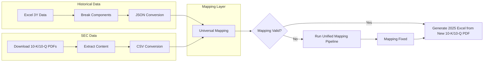

                           📘  Financial Data Normalization – Architecture Document

🏛 **Overview**

This document describes the architecture, data flow, and processing logic used to:

  * Normalize 5 years of financials (Balance Sheet, Income Statement, Cash Flow) from Pre-defined Excel

  * Convert them into structured JSON

  * Extract financial information from SEC 10-K/10-Q PDFs

  * Convert extracted tables to CSV

  * Perform universal mapping across last 5 Years

  * Detect missing components and trigger corrective pipelines

  * Automatically generate future Excel templates (e.g., FY 2025)

This system enables analysts to receive a **clean, consistent financial template** populated using verified mapping logic.

-----------------------------------------------------------------------------------------------------------------------------
🎯 **Objectives**

  * Turn unstructured financial documents into structured datasets

  * Ensure metric consistency across multiple filings

  * Detect and fix gaps in financial mapping

  * Support future automation for SEC filings

  * Enable analysts to focus only on final value adjustments

-------------------------------------------------------------------------------------------------------------------------

🧱 **High-Level Architecture (ETL Flow)**

-----------------------------------------------------------------------------------------------------------------------------
📂 Repository Structure

/project-root
│
├─ data/
│   ├─ excel_raw/              # 3-year historical spreadsheets
│   ├─ json_output/            # generated JSON
│   ├─ pdf_raw/                # downloaded 10-K/10-Q
│   ├─ csv_extracted/          # parsed CSV output
│
├─ mapping/
│   ├─ universal_map.json      # metric mapping dictionary
│   ├─ unified_rules.py        # fix rules for missing values
│
├─ pipelines/
│   ├─ excel_to_json.py
│   ├─ pdf_to_csv.py
│   ├─ mapping_validation.py
│   ├─ mapping_fix_pipeline.py
│   ├─ generate_excel_template.py
│
└─ docs/
    ├─ architecture.md
    ├─ mapping_rules.md

-----------------------------------------------------------------------------------------------------------------------------
    

🧾 Data Inputs

📌 Historical Excel
Contains 3 years of financial statements

Data typically inconsistent in structure

Need to reformat → component-based

📌 SEC Filings
10-K / 10-Q financial disclosures

Unstructured PDF

Extract tables using internal OCR/Table software

🔄 Pipeline Details
1. Excel → JSON Conversion
Purpose:
Convert 3-year Excel data to structured machine-readable format.

Key Tasks

Parse workbook

Normalize field names

Convert to hierarchical JSON

Internal Example

from pipelines.excel_to_json import convert_excel_to_json
json_data = convert_excel_to_json("data/excel_raw/financials.xlsx")
2. PDF → CSV Extraction
Purpose:
Extract financial tables from SEC filings.

Key Tasks

Download PDFs

Read tables

Convert detected values into CSV

Internal Example

from pipelines.pdf_to_csv import extract_pdf_tables
extract_pdf_tables("data/pdf_raw/AMZN_2023_10K.pdf", output_folder="data/csv_extracted/")
3. Universal Mapping
Purpose:
Align financial metrics from historical JSON and SEC CSV data.

Inputs

excel JSON (3Y)

SEC extracted CSV

universal_map.json

Internal Example

mapped = apply_universal_mapping(excel_json, csv_data, mapping_rules)
4. Mapping Validation
Purpose
Determine if all standard financial components have been successfully mapped.

Logic

If True → skip fix pipeline

If False → run automated fix

Internal Example

if validate_mapping(mapped):
    status = "OK"
else:
    status = "MISSING"
5. Unified Mapping Pipeline (Fix Missing Values)
Triggered only when some values are not identified or do not match known attributes.

Internal Example

fixed = fix_mapping_automatically(mapped)
6. Output Generation (e.g., 2025 Template)
Uses the latest SEC filing to produce a new Excel file pre-populated with mapped fields.

Internal Example

generate_excel_template("data/pdf_raw/2025_AMZN_10K.pdf", fixed_values)
Analysts then manually enter final confirmed values into this structured sheet.

🧪 Validation & Quality Checks
Performed at multiple points:

Check if sum of components equals totals

Validate YoY % consistency

Check missing or zero values

Ensure known values map to expected fields

If failing, pipeline halts or reprocesses.

🚀 Benefits
Eliminates manual inconsistencies

Ensures metric standardization

Accelerates financial filing preparation

Scales for multiple companies

Fully documented for audit and compliance

🔮 Future Enhancements
Database storage (PostgreSQL/Snowflake)

Automated anomaly detection

Version control for mapping rules

Deployment to Azure Data Factory or Databricks

Multi-company parallel processing

👥 Stakeholders
Engineering: pipeline development

Data Analysts: template population

Finance Team: accuracy checks

Management: reporting and governance

🏁 Conclusion
This architecture provides a repeatable, scalable, auditable pipeline for leveraging historical and SEC financial data to automate future reporting cycles.
