                           📘  Historical Financial Analysis – Architecture Document

🏛 **Overview**

This document describes the architecture, data flow, and processing logic used to:

  * Normalize 5 years of financials (Balance Sheet, Income Statement, Cash Flow) from Pre-defined Excel

  * Convert them into structured JSON

  * Extract financial information from SEC 10-K/10-Q PDFs

  * Convert extracted tables to CSV

  * Perform universal mapping across last 5 Years

  * Detect missing components and trigger corrective pipelines

  * Automatically generate future Excel templates (e.g., FY 2025)

This system enables analysts to receive a **clean, consistent financial template** populated using verified mapping logic.

-----------------------------------------------------------------------------------------------------------------------------
🎯 **Objectives**

  * Turn unstructured financial documents into structured datasets

  * Ensure metric consistency across multiple filings

  * Detect and fix gaps in financial mapping

  * Support future automation for SEC filings

  * Enable analysts to focus only on final value adjustments

-------------------------------------------------------------------------------------------------------------------------
**❓ Why Are We Automating This Financial Data Analysis?**

**1. Business Problem We Are trying to Solving**

Financial reporting data currently suffers from:

  * ❌ Heavy manual extraction from 10-K / 10-Q PDFs

  * ❌ Human errors in mapping financial line items

  * ❌ Inconsistent handling of Annual vs YTD periods

  * ❌ Long turnaround time for HFA table generation

  * ❌ Poor audit traceability and rework during validation

    As data volume and reporting frequency increase, **manual or semi-manual processing does not scale.**
-------------------------------------------------------------------------------------------------------------------------
**2. Why Automation Is Required**

**🔹 1. Accuracy & Consistency**

Manual mapping leads to:

  * Incorrect financial classifications

  * Period mismatches

  * Inconsistent metric calculations

**Automation ensures:**

  * Single source of truth via unified mapping

  * Repeatable and deterministic results

  * Reduced reconciliation issues

-------------------------------------------------------------------------------------------------------------------------
**🔹 2. Time & Cost Efficiency**

| Activity | Manual Effort ❌ | Automated Effort ✅ |
|---------|----------------|--------------------|
| PDF table extraction | Hours | Seconds |
| Mapping corrections | Manual review | Rule-based |
| Validation | Manual QA | Auto-validation |
| HFA generation | Manual Excel work | Programmatic |

-------------------------------------------------------------------------------------------------------------------------
**🔹 3. Scalability for Multi-Period Data**

The system supports:

   * Annual filings

   * YTD filings

   * Multiple quarters and years

Manual workflows **break** at scale.

Automation **scales horizontally** without increasing human effort.

-------------------------------------------------------------------------------------------------------------------------

**🔹 4. Auditability & Traceability**

  Automation provides:

 * Versioned mappings

 * Raw vs corrected mapping lineage

 * Validation reports


This is critical for:

  * Audit reviews

  * Regulatory compliance

  * Historical restatements
-------------------------------------------------------------------------------------------------------------------------
**📊 Manual vs Automated Financial Data Processing**

```mermaid
flowchart TB

%% ========== STYLES ==========
classDef manual fill:#fdecea,stroke:#e74c3c,color:#000
classDef auto fill:#e8f5e9,stroke:#2ecc71,color:#000
classDef header fill:#e3f2fd,stroke:#1e88e5,font-weight:bold

%% ========== HEADERS ==========
H_STEP[Process Step]:::header
H_MANUAL[❌ Manual Process]:::header
H_AUTO[✅ Automated Process]:::header

%% ========== ROW 1 ==========
S1[PDF/Excel Handling]
M1[Download 10K / 10Q PDFs]:::manual
A1[Upload PDFs & Excel]:::auto

%% ========== ROW 2 ==========
S2[Data Extraction]
M2[Manually Read Tables]:::manual
A2[Automated Table Extraction]:::auto

%% ========== ROW 3 ==========
S3[Data Structuring]
M3[Copy-Paste into Excel]:::manual
A3[Automated Section Detection]:::auto

%% ========== ROW 4 ==========
S4[Mapping Logic]
M4[Manual Mapping per Period]:::manual
A4[Rule-based Mapping Engine]:::auto

%% ========== ROW 5 ==========
S5[Validation]
M5[Manual Validation & Rework]:::manual
A5[Automated Validation Checks]:::auto

%% ========== ROW 6 ==========
S6[Output]
M6[Manual HFA Table Creation]:::manual
A6[Unified & Auto-Generated Mapping]:::auto

%% ========== ALIGNMENT ==========
H_STEP --> S1 --> S2 --> S3 --> S4 --> S5 --> S6
H_MANUAL --> M1 --> M2 --> M3 --> M4 --> M5 --> M6
H_AUTO --> A1 --> A2 --> A3 --> A4 --> A5 --> A6
```


-------------------------------------------------------------------------------------------------------------------------

🧱 **High-Level Architecture (ETL Flow)**


-----------------------------------------------------------------------------------------------------------------------------
📂 Repository Structure

```text
/project-root
│
├─ Calculation_result/
│   ├─ calculated_metric_2023_from_unified_v2.json/       # parsed JSON output
│   ├─ calculated_metric_2023_from_unified_v2.json/          # parsed JSON output
│   ├─ calculated_metric_2024_from_unified_v2.json/          # parsed JSON output
│
├─ data_files/
│   ├─ universal_map.json      # metric mapping dictionary
│   ├─ unified_rules.py        # fix rules for missing values
│
├─  extracted_tables/ELME/
│   ├─ excel_to_json.py
│   ├─ pdf_to_csv.py
│   ├─ mapping_validation.py
│   ├─ mapping_fix_pipeline.py
│   ├─ generate_excel_template.py
│
├─  mappings/
|    ├─ architecture.md
|    ├─ mapping_rules.md
|
├─  section_extraction_data/
│   ├─ excel_to_json.py
│   ├─ pdf_to_csv.py
│   ├─ mapping_validation.py
│   ├─ mapping_fix_pipeline.py
│   ├─ generate_excel_template.py

```

-----------------------------------------------------------------------------------------------------------------------------
    
**🧾 Data Inputs**


📌 **Historical Excels**

   * Contains 5 years of financial statements.

   * Data sets are comprised of numerous fields and complex calculations.

   * Need to reformat → component-based.

**📌 SEC Filings**

   * 10-K / 10-Q financial disclosures.

   * The PDF features various data fields and associated information.

   * Implement structured table extraction leveraging Python functions, OCR and data pipelines.

-----------------------------------------------------------------------------------------------------------------------------

**🔄 Pipeline Details**

**1. Excel → JSON Conversion**

**Purpose:**

Convert 5-year Excel data to structured machine-readable format.

**Key Tasks**

  * Parse Excel Workbook

  * Normalize field names

  * Convert to hierarchical JSON

Internal Example

from pipelines.excel_to_json import convert_excel_to_json
json_data = convert_excel_to_json("data/excel_raw/financials.xlsx")

-----------------------------------------------------------------------------------------------------------------------------

**2. PDF → CSV Extraction**

**Purpose:**

 Extract financial tables from PDF filings.

**Key Tasks**

  * Download PDFs

  * Read tables

  * Convert detected values into CSV

Internal Example

from pipelines.pdf_to_csv import extract_pdf_tables
extract_pdf_tables("data/pdf_raw/AMZN_2023_10K.pdf", output_folder="data/csv_extracted/")

-----------------------------------------------------------------------------------------------------------------------------
**3. Universal Mapping**
   
**Purpose:**

Align financial metrics from historical JSON and SEC CSV data.

**Inputs**

  * excel JSON (5Y)

  * SEC extracted CSV

  * universal_map.json

**Internal Example**

mapped = apply_universal_mapping(excel_json, csv_data, mapping_rules)

-----------------------------------------------------------------------------------------------------------------------------

**4. Mapping Validation**

**Purpose**

Determine if all standard financial components have been successfully mapped.

**Logic**

   * If _True_ → skip fix pipeline

   * If _False_ → run automated fix

**Internal Example**

if validate_mapping(mapped):
    status = "OK"
else:
    status = "MISSING"

-----------------------------------------------------------------------------------------------------------------------------


5. Unified Mapping Pipeline (Fix Missing Values)
Triggered only when some values are not identified or do not match known attributes.

Internal Example

fixed = fix_mapping_automatically(mapped)
6. Output Generation (e.g., 2025 Template)
Uses the latest SEC filing to produce a new Excel file pre-populated with mapped fields.

Internal Example

generate_excel_template("data/pdf_raw/2025_AMZN_10K.pdf", fixed_values)
Analysts then manually enter final confirmed values into this structured sheet.

-----------------------------------------------------------------------------------------------------------------------------


**🧪 Validation & Quality Checks**

   * Performed at multiple points:

   * Check if sum of components equals totals

   * Validate YoY % consistency

  * Check missing or zero values

  * Ensure known values map to expected fields

  * If failing, pipeline halts or reprocesses.

-----------------------------------------------------------------------------------------------------------------------------

**🚀 Benefits**

  * Eliminates manual inconsistencies

  * Ensures metric standardization

  * Accelerates financial filing preparation

  * Scales for multiple companies

  * Fully documented for audit and compliance

-----------------------------------------------------------------------------------------------------------------------------

