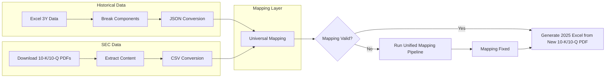
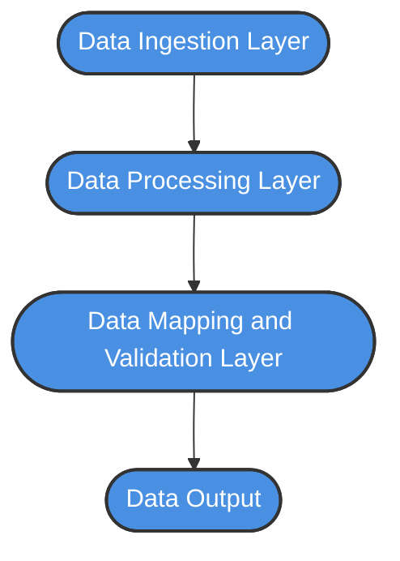

# 📘 HFA – Detailed Walkthrough
> *From Manual Financial Analysis to Automated, Validated Financial Architecture*

## Overview

This document provides a detailed walkthrough of the **HFA (Historical Financial Analysis)** framework:

 *  How HFA was performed earlier.

 *  Why automation was required.

 *  How the current system works logically.

 *  What business and technical benefits are achieved.

# 🔴 Earlier Approach (Manual Process)

This document outlines the step-by-step manual workflow previously used for financial data extraction and analysis.

---

## 📅 Step-by-Step Manual Workflow

The previous process involved several laborious, manual steps to gather, align, and validate financial data from company filings.

### 1. Data Acquisition

The process began with individually sourcing the required filings:

*   Download 10-K / 10-Q PDFs for each reporting period.

### 2. Manual Data Location & Extraction

Key financial statements within the PDFs had to be located and copied manually:

*   Manually locate:
    *   Income Statement
    *   Balance Sheet
    *   Cash Flow Statement

*   Copy-paste tables into Excel.

### 3. Data Alignment & Calculation

Once the raw data was in Excel, significant manual effort was required to structure and analyze it:

*   Manually align line items across years.
*   Write Excel formulas for:
    *   Derived metrics
    *   Aggregations

### 4. Validation

The final step was a manual quality assurance process:

*   Manually validate numbers against prior years.

---

## 🚫 Summary of Limitations

This manual approach was time-consuming, prone to human error during data entry and alignment, and lacked scalability.

---
**📌 Key Risk:**
Even small formula changes caused **silent inaccuracies** across years.

---

🧱 **High-Level Architecture (ETL Flow)**

--------------------------------------------------------------------------------------------------------------------

**Proposed Architecture Logical Layering:**

-------------------------------------------------------------------------------------------------------------------------
# 4️⃣ Automated Architecture – Logical Walkthrough

This section explains the "intellectual engine" behind the HFA system. It outlines how we transitioned from static spreadsheets to a dynamic, logic-based architecture that treats financial analysis as code.

---

# 5️⃣ Step-by-Step Automated Flow

### Step 1️⃣ Standardizing Formula Definitions
**What We Did**
*   Extracted legacy Excel formulas from historical sheets.
*   Converted complex logic into machine-readable **JSON** objects.
*   Explicitly defined all mathematical dependencies.

**Why This Matters**
*   **Auditability:** Excel hides logic inside cells; JSON exposes it.
*   **Version Control:** Logic can now be tracked via Git (who changed a formula and why).
*   **Reusability:** Formulas are no longer tied to a specific file.

> **📌 Outcome:** Formula logic is now **Code**, not hidden spreadsheets.

---

### Step 2️⃣ Automated Data Extraction from Filings
**What We Did**
*   Programmatically extracted financial tables from 10-K / 10-Q PDFs.
*   Converted unstructured PDF tables into structured **CSV files**.
*   Maintained strict statement-level separation (Income Statement, Balance Sheet, Cash Flow).

**Why This Matters**
*   Eliminates manual copy-paste "fat-finger" errors.
*   Ensures raw data integrity remains untainted.
*   Enables high-speed programmatic processing.

> **📌 Outcome:** Raw financial data becomes **Structured Input**.

---

### Step 3️⃣ Formula Parsing & Mapping Logic
**What We Did**
*   Parsed formulas into an **Abstract Syntax Tree (AST)**.
*   Mapped formula variables (e.g., `EBITDA`) to specific extracted CSV values.
*   Created dynamic, year-specific mappings.

**Conceptual Example:**
`EBITDA = Operating_Income + Depreciation + Amortization`
*   **Mapped to:** Specific CSV columns + Reporting Year + Filing Type.

**Why This Matters**
*   Decouples the **Logic** (the formula) from the **Data** (the CSV).
*   Avoids the need for hardcoded, year-based formulas.

> **📌 Outcome:** Formulas **dynamically bind** to data.

---

### Step 4️⃣ Unified Mapping Across Years
**The Challenge**
Financial filings are inconsistent. Different years may have naming inconsistencies (e.g., "Net Sales" vs "Revenue") or missing line items.

**What We Did**
Built a **Mapping Unification Layer** that classifies metrics into three buckets:
1.  **Non-conflicting:** Direct matches across years.
2.  **Conflicting:** Items requiring resolution rules.
3.  **Derived Metrics:** Calculated based on available data points.

**Why This Matters**
*   Creates a "Single Source of Truth" for line items across a decade of filings.

> **📌 Outcome:** A single **unified mapping** usable across all years.

---

### Step 5️⃣ Automated Validation Logic
**What We Did**
*   Validated calculated metrics against the previous 3 years of data.
*   Compared automated outputs with historical benchmarks.
*   **Self-Healing:** The system auto-adjusts mappings if validation fails a threshold check.

**Why This Matters**
*   Mimics human cross-checking but at 100x the speed.
*   Ensures high confidence levels before the data reaches stakeholders.

> **📌 Outcome:** The system **self-corrects** before publishing results.

---

### Step 6️⃣ Final Historical Financial Calculations
**The Final Action**
*   Applied the validated, unified mappings to the entire data set.
*   Calculated all metrics for every reporting period simultaneously.
*   Produced consistent, auditable, and structured outputs.

> **📌 Final Result:** A fully reliable, machine-generated **Historical Financial Dataset**.

