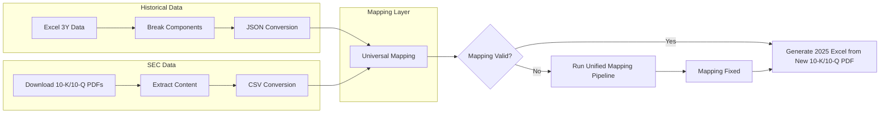
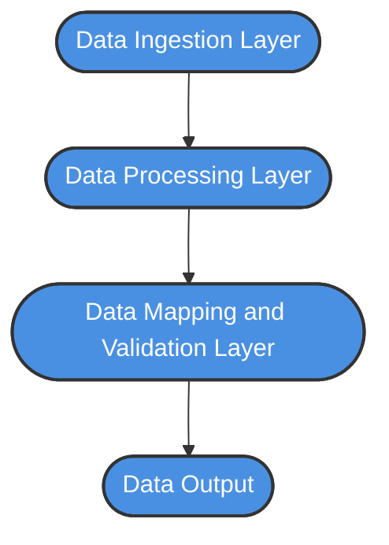

# 📘 HFA – Detailed Walkthrough
> *From Manual Financial Analysis to Automated, Validated Financial Architecture*

## Overview

This document provides a detailed walkthrough of the **HFA (Historical Financial Analysis)** framework:

 *  How HFA was performed earlier.

 *  Why automation was required.

 *  How the current system works logically.

 *  What business and technical benefits are achieved.

# 🔴 Earlier Approach (Manual Process)

This document outlines the step-by-step manual workflow previously used for financial data extraction and analysis.

---

## 📅 Step-by-Step Manual Workflow

The previous process involved several laborious, manual steps to gather, align, and validate financial data from company filings.

### 1. Data Acquisition

The process began with individually sourcing the required filings:

*   Download 10-K / 10-Q PDFs for each reporting period.

### 2. Manual Data Location & Extraction

Key financial statements within the PDFs had to be located and copied manually:

*   Manually locate:
    *   Income Statement
    *   Balance Sheet
    *   Cash Flow Statement

*   Copy-paste tables into Excel.

### 3. Data Alignment & Calculation

Once the raw data was in Excel, significant manual effort was required to structure and analyze it:

*   Manually align line items across years.
*   Write Excel formulas for:
    *   Derived metrics
    *   Aggregations

### 4. Validation

The final step was a manual quality assurance process:

*   Manually validate numbers against prior years.

---

## 🚫 Summary of Limitations

This manual approach was time-consuming, prone to human error during data entry and alignment, and lacked scalability.

---
**📌 Key Risk:**
Even small formula changes caused **silent inaccuracies** across years.

---

🧱 **High-Level Architecture (ETL Flow)**

--------------------------------------------------------------------------------------------------------------------

**Proposed Architecture Logical Layering:**

-------------------------------------------------------------------------------------------------------------------------

--------------------------------------------------------------------------------------------------------------------------

