```mermaid

flowchart LR

    subgraph Historical Data
        A1[Excel 3Y Data] --> B1[Break Components]
        B1 --> C1[JSON Conversion]
    end

    subgraph SEC Data
        A2[Download 10-K/10-Q PDFs] --> B2[Extract Content]
        B2 --> C2[CSV Conversion]
    end

    subgraph Mapping Layer
        C1 --> D[Universal Mapping]
        C2 --> D
    end

    D --> I{Mapping Valid?}

    I -->|Yes| Z[Generate 2025 Excel from New 10-K/10-Q PDF]

    I -->|No| E[Run Unified Mapping Pipeline]
    E --> F[Mapping Fixed]
    F --> Z


    ```
# PGIM Dealio — Financial Analysis & Credit Risk Intelligence Platform

 

An AI-powered financial data processing and credit risk analysis platform that extracts structured data from SEC filings, generates automated quarterly reports (AQRR), performs financial statement analysis, monitors news for credit signals, and provides interactive data lineage chat interfaces.

 

---

 

## Table of Contents

 

- [Architecture Overview](#architecture-overview)

- [Repository Layout](#repository-layout)

- [Prerequisites](#prerequisites)

- [Quick Start (Local)](#quick-start-local)

- [Configuration](#configuration)

- [Using Azure OpenAI](#using-azure-openai)

- [Component Architecture & Details](#component-architecture--details)

  - [Report Generation Components](#report-generation-components)

  - [Financial Analysis Components](#financial-analysis-components)

  - [Company Data Components](#company-data-components)

  - [News & Credit Risk Components](#news--credit-risk-components)

  - [Interactive Chat Components](#interactive-chat-components)

  - [Supporting Components](#supporting-components)

- [Data & Storage](#data--storage)

- [Telemetry & Logging](#telemetry--logging)

- [Runbook & CLI Commands](#runbook--cli-commands)

- [Deployment](#deployment)

 

---

 

## Architecture Overview

 

The system is composed of **Azure Functions** (serverless API backend), **Python processing pipelines** (table extraction, mapping, calculation, validation), and a **news monitoring component** (credit risk signal detection). All components integrate with Azure OpenAI for LLM-powered analysis and Azure Application Insights for observability.

 

### System Components

 

```

┌─────────────────────────────────────────────────────────────────────────┐

│                           Client / Frontend                              │

│         (Static Web App / External API Consumers)                       │

└──────────────────────────────┬──────────────────────────────────────────┘

                               │ HTTPS/JSON

                               ▼

┌──────────────────────────────────────────────────────────────────────────┐

│                      Azure Functions (HTTP API)                          │

│                         Route Prefix: /api/v1                           │

│  ┌─────────────────────────────────────────────────────────────────┐   │

│  │ 18 HTTP-Triggered Functions (Python 3.10+)                     │   │

│  │ • Report Generation (AQRR, PDF, Word)                          │   │

│  │ • Financial Analysis (HFA, FSA, Cap Table, Covenants)          │   │

│  │ • Company Data (Tables, Dropdowns, Credit)                     │   │

│  │ • News Analysis (Credit Risk Signals)                          │   │

│  │ • Interactive Chat (Lineage, On-Demand Insights)               │   │

│  └─────────────────────────────────────────────────────────────────┘   │

└──────────────────────────────┬──────────────────────────────────────────┘

                               │

            ┌──────────────────┼──────────────────┐

            ▼                  ▼                  ▼

    ┌──────────────┐  ┌──────────────┐  ┌──────────────┐

    │ Azure OpenAI │  │ Blob Storage │  │ App Insights │

    │  (GPT-4.1)   │  │ (Data/Logs)  │  │ (Telemetry)  │

    │              │  │              │  │              │

    │ • Chat       │  │ • HFA/FSA    │  │ • Traces     │

    │ • Embeddings │  │ • Cap Tables │  │ • Metrics    │

    │ • Cost Track │  │ • Covenants  │  │ • Cost Track │

    └──────────────┘  └──────────────┘  └──────────────┘

            │                  │                  │

            └──────────────────┼──────────────────┘

                               │

                    ┌──────────▼──────────┐

                    │  Python Pipelines   │

                    │  ┌───────────────┐  │

                    │  │ Table Extract │  │  SEC PDFs → Structured Tables

                    │  │ Mapping       │  │  Build metric mappings

                    │  │ Calculation   │  │  Compute financial metrics

                    │  │ Validation    │  │  Reconcile vs actuals

                    │  │ AQRR Generate │  │  PDF/Word reports

                    │  └───────────────┘  │

                    └─────────────────────┘

                               │

                    ┌──────────▼──────────┐

                    │  External Services  │

                    │  • SEC API          │

                    │  • yfinance         │

                    │  • Google News RSS  │

                    │  • DuckDuckGo News  │

                    └─────────────────────┘

```

 

### Key Design Patterns

 

- **LLM-Assisted Extraction**: Azure OpenAI GPT-4.1 extracts tables from SEC filing PDFs using PageIndex-guided prompts

- **Dependency-Aware Calculation**: Metric calculator resolves AST-based formulas with period offsets and external references

- **Agentic Workflows**: Multi-agent systems for mapping correction, validation, and reconciliation

- **Observability-First**: OpenTelemetry + Application Insights capture all LLM calls with token usage, cost, and lineage

- **Message-Based Pipelines**: Modular Python scripts orchestrate end-to-end workflows

 

---

 

## Repository Layout

 

```

PGIM-Dev/

├── Azure-Functions/                    # Azure Functions (serverless API)

│   ├── host.json                       # Function host config (30min timeout, /api/v1 prefix)

│   ├── local.settings.json             # Local env vars (not committed)

│   ├── requirements.txt                # Python dependencies for Functions

│   ├── manage.ps1                      # PowerShell deployment helper

│   │

│   ├── AQRRFunction/                   # AQRR report data generation

│   │   ├── __init__.py                 # Function entry point

│   │   └── function.json               # Route: POST /api/v1/aqrr-pdf-word

│   │

│   ├── AQRRPDFFunction/                # AQRR PDF generation

│   │   ├── __init__.py

│   │   └── function.json               # Route: POST /api/v1/aqrr-pdf

│   │

│   ├── AQRRWordFunction/               # AQRR Word document generation

│   │   ├── __init__.py

│   │   └── function.json               # Route: POST /api/v1/aqrr-word

│   │

│   ├── CapTableFunction/               # Capitalization table generation

│   │   ├── __init__.py

│   │   └── function.json               # Route: POST /api/v1/cap-table

│   │

│   ├── CompFunction/                   # Comparable analysis (read from Blob)

│   │   ├── __init__.py

│   │   └── function.json               # Route: POST /api/v1/comp

│   │

│   ├── CompanyDropdownFunction/        # Company list for UI dropdown

│   │   ├── __init__.py

│   │   └── function.json               # Route: GET/POST /api/v1/company-dropdown

│   │

│   ├── CompanyTableFunction/           # Company exposure table

│   │   ├── __init__.py

│   │   └── function.json               # Route: POST /api/v1/company-table

│   │

│   ├── CovenantTableFunction/          # Covenant summary table

│   │   ├── __init__.py

│   │   └── function.json               # Route: POST /api/v1/covenant-table

│   │

│   ├── CreditTableFunction/            # Credit risk merits/risks

│   │   ├── __init__.py

│   │   └── function.json               # Route: POST /api/v1/credit-table

│   │

│   ├── FSAFunction/                    # Financial Statement Analysis (LLM-powered)

│   │   ├── __init__.py

│   │   └── function.json               # Route: POST /api/v1/fsa

│   │

│   ├── HFAFunction/                    # Historical Financial Analysis

│   │   ├── __init__.py

│   │   └── function.json               # Route: POST /api/v1/hfa

│   │

│   ├── LineageStartFunction/           # Start data lineage chat session

│   │   ├── __init__.py

│   │   └── function.json               # Route: POST /api/v1/lineage/chat/start

│   │

│   ├── LineageMessageFunction/         # Data lineage chat message

│   │   ├── __init__.py

│   │   └── function.json               # Route: POST /api/v1/lineage/chat/message

│   │

│   ├── NewsFunction/                   # Credit risk news analysis

│   │   ├── __init__.py

│   │   └── function.json               # Route: POST /api/v1/news/analyze

│   │

│   ├── ODIMessageFunction/             # On-Demand Insights message

│   │   ├── __init__.py

│   │   └── function.json               # Route: POST /api/v1/odi/chat/message

│   │

│   ├── ODIStartFunction/               # On-Demand Insights start

│   │   ├── __init__.py

│   │   └── function.json               # Route: POST /api/v1/odi/chat/start

│   │

│   ├── OnDemandInsightsFunction/       # On-Demand Insights main endpoint

│   │   ├── __init__.py

│   │   └── function.json               # Route: POST /api/v1/query

│   │

│   ├── RatingsRationaleFunction/       # Ratings rationale generation

│   │   ├── __init__.py

│   │   └── function.json               # Route: POST /api/v1/ratings-rationale

│   │

│   ├── src/                            # Shared Python source code

│   │   ├── telemetry_config.py         # OpenTelemetry + App Insights config

│   │   ├── run_cap_table.py            # Cap table builder (LLM-based)

│   │   ├── run_covenant_table.py       # Covenant table builder

│   │   ├── run_fsa.py                  # FSA narrative builder

│   │   ├── run_credit_risk_merits.py   # Key credit merits/risks

│   │   ├── mapping.py                  # Mapping utilities (CSV/section lookup)

│   │   ├── calc_improved_v2.py         # Dependency-aware calculator

│   │   ├── validator_improved.py       # Validator (calc vs actuals)

│   │   ├── parser.py                   # Formula parser (Excel-like AST)

│   │   ├── solver.py                   # AST evaluator

│   │   ├── helper.py                   # Text normalization utilities

│   │   ├── table_extraction/           # Table extraction from PDFs

│   │   │   ├── table_extraction_page_index.py  # PageIndex-guided extractor

│   │   │   ├── post_process_tables.py  # Header/key normalization

│   │   │   ├── key_norm.py             # Key normalization with LLM

│   │   │   └── concat_tables.py        # Multi-page table concatenation

│   │   ├── agents/                     # Agentic modules

│   │   │   └── data_lineage_agent.py   # Data lineage Q&A agent

│   │   └── ...

│   │

│   ├── news_component/                 # News monitoring & risk analysis

│   │   ├── app.py                      # Streamlit UI (local dev)

│   │   ├── function_app.py             # Azure Function entry (JSON API)

│   │   ├── requirements.txt            # News component dependencies

│   │   ├── host.json                   # Function host config

│   │   ├── config/

│   │   │   ├── keywords.py             # Risk/reward keyword taxonomy (weighted)

│   │   │   └── settings.py             # App-wide settings

│   │   ├── fetchers/                   # News fetchers (parallel async)

│   │   │   ├── ddgs_fetcher.py         # DuckDuckGo News search

│   │   │   ├── rss_fetcher.py          # Google News RSS parser

│   │   │   ├── yfinance_fetcher.py     # Yahoo Finance news

│   │   │   └── parallel_fetcher.py     # Async orchestration

│   │   ├── analysis/                   # Risk analysis engine

│   │   │   ├── keyword_analyzer.py     # Keyword matching

│   │   │   ├── risk_scorer.py          # Weighted risk/reward scoring

│   │   │   ├── categorizer.py          # Category classification

│   │   │   └── trend_analyzer.py       # Trend detection

│   │   ├── llm/

│   │   │   ├── client.py               # Azure OpenAI client wrapper

│   │   │   └── summarizer.py           # Batch article summarizer

│   │   └── ...

│   │

│   ├── static/

│   │   └── company_ticker.json         # Ticker → company name mapping

│   │

│   └── utils/                          # Shared utilities

│       └── azure_blob_storage.py       # Blob storage helpers

│

├── src/                                # Core Python modules (standalone scripts)

│   ├── aqrr_pdf_generate.py            # AQRR PDF generator (FastAPI)

│   ├── aqrr_word_generate.py           # AQRR Word generator (FastAPI)

│   ├── auto_validation_v3.py           # Automated validation loop with LLM

│   ├── calc_improved_v2.py             # Calculator (dependency-aware)

│   ├── mapping.py                      # Mapping builder

│   ├── universal_mapper_improved.py    # Universal mapping builder

│   ├── reconcile_unified_by_subtotals_v2.py  # Reconciliation with LLM

│   ├── table_extraction/               # Table extraction (PageIndex-based)

│   └── agents/

│       └── data_lineage_agent.py       # Data lineage Q&A agent

│

├── data_files/                         # Input XLSM files per company

│   └── {TICKER}/                       # e.g., ELME/, AME/

│       └── *.xlsm                      # Allvue data files

│

├── pdfs/                               # SEC PDFs (10-K, 10-Q)

│   └── {TICKER}/                       # e.g., ELME/, AME/

│       ├── *_10K_*.pdf

│       └── *_10Q_*.pdf

│

├── aqrr_structure/                     # AQRR template structures (JSON)

│   └── {TICKER}/

│       └── *_aqrr_*_structure.json

│

├── cap_outputs/                        # Cap table outputs

│   └── {TICKER}/

│       ├── cap_tables/                 # Generated cap tables by period

│       ├── structures/                 # Cap structure definitions

│       └── logs/                       # Extraction logs with lineage

│

├── compliance_certificate_outputs/     # Covenant table outputs

│   └── {TICKER}/

│       ├── json/                       # Covenant data (JSON)

│       └── structure/                  # Compliance structure definitions

│

├── fsa_outputs/                        # FSA JSON outputs

│   └── {TICKER}/

│       └── FSA_*.json

│

├── hfa_output/                         # HFA XLSM/CSV outputs

│   └── {TICKER}/

│       ├── *.xlsm

│       └── *.csv

│

├── extracted_tables_pageindex/         # Extracted tables (JSON/CSV)

│   └── {TICKER}/

│       ├── json/                       # Raw extracted tables

│       ├── clusters/                   # Table clustering metadata

│       └── csv/                        # Normalized CSV tables

│

├── mappings/                           # Per-period mapping files

│   └── {TICKER}/{PERIOD}/

│       └── mapping_*.json

│

├── calculation_results/                # Calculated metrics (JSON)

│   └── {TICKER}/{Annual|YTD}/

│       └── calculated_metrics_*.json

│

├── validation_results/                 # Validation matched/unmatched

│   └── {TICKER}/{PERIOD}/

│       ├── matched.json

│       └── unmatched.json

│

├── logs/                               # Pipeline logs

│   └── {TICKER}/{PERIOD}/

│       ├── agent.anchor_analyzer[...].prompt.txt

│       ├── agent.patcher[...].raw.txt

│       └── preflight.agent.*.txt

│

├── requirements.txt                    # Root Python dependencies

├── readme.md                           # Original project README

└── README_updated.md                   # This file

```

 

---

 

## Prerequisites

 

| Tool | Version | Purpose | Installation |

|------|---------|---------|--------------|

| **Python** | `3.10+` | Functions runtime (specified in `host.json`) | [Download](https://www.python.org/downloads/) |

| **Azure Functions Core Tools** | `v4.x` | Local testing and deployment (`func start`) | [Install Guide](https://learn.microsoft.com/azure/azure-functions/functions-run-local) |

| **Node.js** | `18 LTS` | Required by Azure Functions Core Tools | [Download](https://nodejs.org/) |

| **Azure CLI** | Latest | Deployment and resource management | [Install Guide](https://learn.microsoft.com/cli/azure/install-azure-cli) |

| **Git** | Latest | Version control | [Download](https://git-scm.com/) |

| **PowerShell** | `7+` (optional) | For using `manage.ps1` deployment helper (Windows) | [Install Guide](https://learn.microsoft.com/powershell/) |

| **Azurite** | Latest (optional) | Local Storage emulator for development | [Install Guide](https://learn.microsoft.com/azure/storage/common/storage-use-azurite) |

 

**Notes**:

- Python version determined from `host.json`: `"FUNCTIONS_WORKER_RUNTIME": "python"` and Extension Bundle v3

- Azure Functions Core Tools v4 required for Python 3.10+ support

- Azurite is optional - you can use a real Azure Storage account for local development

 

---

 

## Quick Start (Local)

 

### 1. Clone & Setup

 

```bash

git clone <repository-url>

cd PGIM-latest/PGIM-Dev

 

# Create virtual environment

python -m venv .venv

 

# Activate virtual environment

source .venv/Scripts/activate   # Windows Git Bash

# source .venv/bin/activate     # Linux / macOS

 

# Install Azure Functions dependencies

cd Azure-Functions

pip install -r requirements.txt

```

 

### 2. Configure Environment Variables

 

Edit `Azure-Functions/local.settings.json`:

 

```json

{

  "IsEncrypted": false,

  "Values": {

    "FUNCTIONS_WORKER_RUNTIME": "python",

    "AzureWebJobsStorage": "UseDevelopmentStorage=true",

 

    "AZURE_OPENAI_ENDPOINT": "https://<your-resource>.cognitiveservices.azure.com/",

    "AZURE_OPENAI_DEPLOYMENT": "gpt-4.1",

    "AZURE_OPENAI_API_KEY": "<your-api-key>",

    "AZURE_OPENAI_API_VERSION": "2024-12-01-preview",

 

    "AZURE_OPENAI_EMBEDDING_DEPLOYMENT": "text-embedding-3-large",

    "AZURE_OPENAI_EMBEDDING_API_VERSION": "2023-05-15",

 

    "AZURE_STORAGE_CONNECTION_STRING": "<your-storage-connection-string>",

    "AZURE_BLOB_STORAGE_CONNECTION_STRING": "<same-as-above>",

 

    "OTEL_APPLICATIONINSIGHTS_CONNECTION_STRING": "InstrumentationKey=<key>;IngestionEndpoint=https://eastus-8.in.applicationinsights.azure.com/;...",

 

    "SEC_API_KEY": "<sec-api-key>",

    "STORAGE_MODE": "blob",

    "USER_NAME": "<api-user>",

    "PASSWORD": "<api-password>"

  }

}

```

 

**⚠️ Security Note**: `local.settings.json` is listed in `.funcignore` / `.gitignore`. **Never commit real secrets to version control.**

 

### 3. Start Azure Functions Locally

 

```bash

# From Azure-Functions/ directory

func start

 

# Or specify a custom port

func start --port 7073

```

 

Functions will be available at:

 

```

http://localhost:7071/api/v1/<route>

```

 

### 4. Test an Endpoint

 

```bash

# Test HFA Function

curl -X POST http://localhost:7071/api/v1/hfa \

  -H "Content-Type: application/json" \

  -d '{"ticker": "ELME"}'

 

# Test News Function

curl -X POST http://localhost:7071/api/v1/news/analyze \

  -H "Content-Type: application/json" \

  -d '{"company": "AMETEK", "days": 7, "enable_llm": false}'

 

# Test Cap Table Function

curl -X POST http://localhost:7071/api/v1/cap-table \

  -H "Content-Type: application/json" \

  -d '{"ticker": "ELME", "period": "2025_q1"}'

```

 

---

 

## Configuration

 

### Azure Functions Host (`host.json`)

 

**File Location**: [Azure-Functions/host.json](Azure-Functions/host.json)

 

```json

{

  "version": "2.0",

  "functionTimeout": "00:30:00",

  "logging": {

    "applicationInsights": {

      "samplingSettings": {

        "isEnabled": false

      }

    }

  },

  "extensionBundle": {

    "id": "Microsoft.Azure.Functions.ExtensionBundle",

    "version": "[3.*, 4.0.0)"

  },

  "extensions": {

    "http": {

      "routePrefix": "api/v1"

    }

  }

}

```

 

**Key Settings**:

 

| Setting | Value | Purpose |

|---------|-------|---------|

| `functionTimeout` | `00:30:00` | 30-minute max execution time (needed for long-running LLM operations) |

| `extensions.http.routePrefix` | `"api/v1"` | All routes prefixed with `/api/v1` |

| `extensionBundle.version` | `"[3.*, 4.0.0)"` | Extension Bundle v3 (supports Python 3.10+) |

| `logging.applicationInsights.samplingSettings.isEnabled` | `false` | Disables sampling (captures 100% of telemetry) |

 

### Environment Variables

 

All environment variables are configured in `local.settings.json` (local) or Azure Portal → Function App → Configuration → Application Settings (production).

 

| Variable | Required | Purpose | Example | Used By |

|----------|----------|---------|---------|---------|

| **Azure OpenAI** |

| `AZURE_OPENAI_ENDPOINT` | ✅ | Azure OpenAI resource endpoint | `https://pgim-ppc-dociq-eastus-dev.cognitiveservices.azure.com/` | All LLM calls ([news_component/llm/client.py:294](Azure-Functions/news_component/llm/client.py#L294)) |

| `AZURE_OPENAI_DEPLOYMENT` | ✅ | Deployment name (maps to model) | `gpt-4.1` | LLM client ([news_component/llm/client.py:313](Azure-Functions/news_component/llm/client.py#L313)) |

| `AZURE_OPENAI_API_KEY` | ✅ | API key for Azure OpenAI | `GyED0bAhj2...` | LLM client ([news_component/llm/client.py:285](Azure-Functions/news_component/llm/client.py#L285)) |

| `AZURE_OPENAI_API_VERSION` | ✅ | API version | `2024-12-01-preview` | LLM client ([news_component/llm/client.py:302](Azure-Functions/news_component/llm/client.py#L302)) |

| `AZURE_OPENAI_EMBEDDING_DEPLOYMENT` | ⚠️ | Embedding model deployment | `text-embedding-3-large` | Chat engine embeddings |

| `AZURE_OPENAI_EMBEDDING_API_VERSION` | ⚠️ | Embedding API version | `2023-05-15` | Chat engine |

| **Storage** |

| `AZURE_STORAGE_CONNECTION_STRING` | ✅ | Connection string for Blob/Tables | `DefaultEndpointsProtocol=https;AccountName=dealiostorage;...` | Blob storage operations |

| `AZURE_BLOB_STORAGE_CONNECTION_STRING` | ⚠️ | Alias for above | Same as above | Some functions |

| `AzureWebJobsStorage` | ✅ | Functions host storage | `UseDevelopmentStorage=true` (local) or connection string | Functions runtime |

| **Telemetry** |

| `OTEL_APPLICATIONINSIGHTS_CONNECTION_STRING` | ⚠️ | Application Insights connection | `InstrumentationKey=df845528-...` | [src/telemetry_config.py:161](Azure-Functions/src/telemetry_config.py#L161) |

| `APPLICATIONINSIGHTS_CONNECTION_STRING` | ⚠️ | Fallback for above | Same format | Telemetry fallback |

| **External APIs** |

| `SEC_API_KEY` | ⚠️ | SEC API key (sec-api.io) | `xyz` | [src/sec_pdf.py:662](Azure-Functions/src/sec_pdf.py#L662), FSA, PDF download |

| **Authentication** |

| `USER_NAME` | ⚪ | API basic auth username | `apiadmin@pgim.com` | Some endpoints |

| `PASSWORD` | ⚪ | API basic auth password | `***` | Some endpoints |

| `X_USER` / `X_PASS` | ⚪ | Alternative auth credentials | `xapiadmin@pgim.com` / `***` | Some endpoints |

| **Other** |

| `STORAGE_MODE` | ⚪ | Storage mode | `blob` | Storage abstraction |

| `FUNCTIONS_WORKER_RUNTIME` | ✅ | Runtime language | `python` | Functions host |

 

**Legend**: ✅ Required | ⚠️ Recommended | ⚪ Optional

 

---

 

## Using Azure OpenAI

 

### How it Works

 

All LLM interactions use the **Azure OpenAI SDK** (`openai>=1.x`) with the `AzureOpenAI` client.

 

**Key Files**:

- **LLM Client**: [Azure-Functions/news_component/llm/client.py](Azure-Functions/news_component/llm/client.py#L255-L448)

- **Telemetry Integration**: [Azure-Functions/src/telemetry_config.py](Azure-Functions/src/telemetry_config.py#L237-L241)

 

### Configuration Mapping

 

Azure OpenAI uses **deployment names** instead of model names:

 

| OpenAI SDK Parameter | Azure OpenAI Mapping | Environment Variable |

|---------------------|---------------------|---------------------|

| `model` | **Deployment name** | `AZURE_OPENAI_DEPLOYMENT` |

| `api_key` | API key | `AZURE_OPENAI_API_KEY` |

| `base_url` | Endpoint URL | `AZURE_OPENAI_ENDPOINT` |

| `api_version` | API version | `AZURE_OPENAI_API_VERSION` |

 

**Example**: If your Azure OpenAI deployment is named `gpt-4.1`, you pass `model="gpt-4.1"` to `client.chat.completions.create()`.

 

### Code Example

 

**From**: [Azure-Functions/news_component/llm/client.py:324-333](Azure-Functions/news_component/llm/client.py#L324-L333)

 

```python

from openai import AzureOpenAI

import os

 

client = AzureOpenAI(

    api_key=os.getenv("AZURE_OPENAI_API_KEY"),

    azure_endpoint=os.getenv("AZURE_OPENAI_ENDPOINT"),

    api_version=os.getenv("AZURE_OPENAI_API_VERSION"),

)

 

response = client.chat.completions.create(

    model=os.getenv("AZURE_OPENAI_DEPLOYMENT"),  # Deployment name, e.g., "gpt-4.1"

    messages=[

        {"role": "system", "content": "You are a financial analyst."},

        {"role": "user", "content": "Summarize Q1 earnings for AMETEK."}

    ],

    temperature=0.2,

    max_tokens=1000,

)

 

print(response.choices[0].message.content)

```

 

### Deployment Name vs Model Name

 

**Important**: In Azure OpenAI, the `model` parameter in API calls refers to your **deployment name**, not the underlying model name.

 

- ✅ **Correct**: `model="gpt-4.1"` (your deployment name in Azure Portal)

- ❌ **Incorrect**: `model="gpt-4-turbo"` (OpenAI model name)

 

**How to find your deployment name**:

1. Go to Azure Portal → Azure OpenAI resource

2. Navigate to **Deployments**

3. Copy the **Deployment name** (e.g., `gpt-4.1`, `gpt-4o-mini`)

4. Set `AZURE_OPENAI_DEPLOYMENT=<deployment-name>` in `local.settings.json`

 

---

 

## Runbook & CLI Commands

 

### Starting Services

 

```bash

# Start Azure Functions locally

cd Azure-Functions

func start

 

# Start on custom port

func start --port 7073

 

# Start News Component Streamlit UI (local dev only)

cd Azure-Functions/news_component

streamlit run app.py

```

 

### Deployment (PowerShell Helper)

 

**File Location**: [Azure-Functions/manage.ps1](Azure-Functions/manage.ps1)

 

```powershell

# Deploy to existing Function App

cd Azure-Functions

.\manage.ps1 -Action deployExisting `

  -ResourceGroup PGIM-Dealio `

  -FunctionAppName pgim-dealio `

  -StorageAccountName pgimdealio

 

# Create new resources and deploy

.\manage.ps1 -Action deployNew `

  -ResourceGroup <rg-name> `

  -FunctionAppName <func-app-name> `

  -StorageAccountName <storage-name> `

  -Location eastus2

 

# Verify deployment

.\manage.ps1 -Action testDeployment `

  -ResourceGroup PGIM-Dealio `

  -FunctionAppName pgim-dealio

```

 

### Pipeline Scripts (Standalone)

 

```bash

# Extract tables from SEC PDFs (PageIndex-based)

python src/table_extraction/table_extraction_page_index.py \

  --ticker AMETEK \

  --pdf pdfs/AME/ame_10K_2024.pdf \

  --output extracted_tables_pageindex/AME

 

# Post-process extracted tables (normalize headers/keys)

python src/table_extraction/post_process_tables.py \

  --ticker AMETEK \

  --period 2024

 

# Build mappings from extracted tables

python src/mapping.py --ticker AMETEK --period 2024

 

# Build universal mapping (merge per-period mappings)

python src/universal_mapper_improved.py --ticker AMETEK

 

# Calculate metrics from universal mapping

python src/calc_improved_v2.py --ticker AMETEK --period 2024

 

# Validate calculated vs actuals

python src/validator_improved.py --ticker AMETEK --period 2024

 

# Generate AQRR PDF

python src/aqrr_pdf_generate.py --ticker AMETEK --period 2024 --output aqrr_outputs/

 

# Run cap table builder

python src/run_cap_table.py --ticker ELME --period 2025_q1

 

# Run FSA generation

python src/run_fsa.py --ticker ELME --period 2025_q1

 

# Run covenant table extraction

python src/run_covenant_table.py --ticker ELME --period 2025_q1

```

 

### Testing & Verification

 

```bash

# News component tests

cd Azure-Functions/news_component

pytest tests/ -v

 

# Quick import verification

python tests/verify_imports.py

 

# Run specific phase tests

pytest tests/test_phase3.py -v  # Parallel fetcher tests

pytest tests/test_phase4.py -v  # Database persistence

pytest tests/test_phase5.py -v  # LLM summarization

pytest tests/test_phase6.py -v  # Integration tests

```

 

---

 

## Component Architecture & Details

 

This section provides detailed architecture diagrams and descriptions for each Azure Function component organized by category.

 

---

 

### Report Generation Components

 

These components generate various formats of the AQRR (Automated Quarterly Risk Report).

 

#### AQRRFunction

 

**Route**: `POST /api/v1/aqrr-pdf-word`

**Auth Level**: `function`

**Purpose**: Generates complete AQRR report data in JSON format by aggregating data from multiple sources.

 

**Architecture**:

 

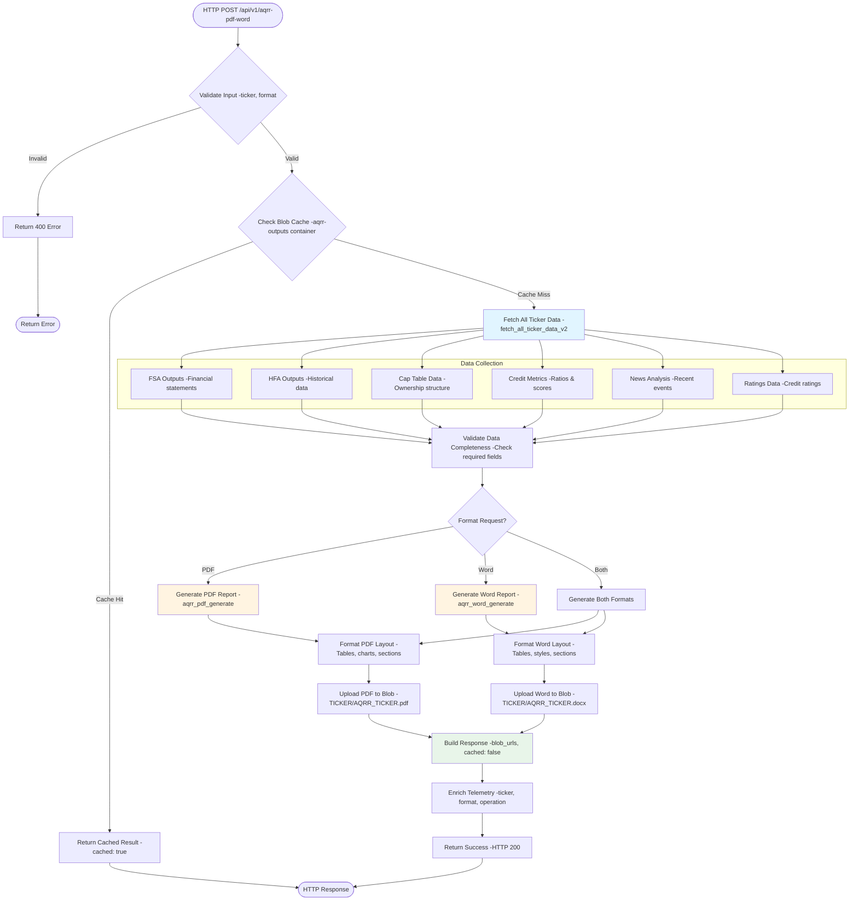

 

**Key Features**:

- Aggregates data from multiple Blob Storage containers

- Combines HFA, FSA, Cap Table, Covenant, and Company data

- Returns structured JSON ready for PDF/Word rendering

- Caches results to reduce redundant processing

 

**File Location**: [Azure-Functions/AQRRFunction/\_\_init\_\_.py](Azure-Functions/AQRRFunction/__init__.py)

 

---

 

#### AQRRPDFFunction & AQRRWordFunction

 

**Routes**: `POST /api/v1/aqrr-pdf` | `POST /api/v1/aqrr-word`

**Auth Level**: `function`

**Purpose**: Generates AQRR report in PDF or Word format.

 

**Architecture**: Similar to AQRRFunction but adds document rendering layer (ReportLab for PDF, python-docx for Word).

 

**File Locations**:

- [Azure-Functions/AQRRPDFFunction/\_\_init\_\_.py](Azure-Functions/AQRRPDFFunction/__init__.py)

- [Azure-Functions/AQRRWordFunction/\_\_init\_\_.py](Azure-Functions/AQRRWordFunction/__init__.py)

 

---

 

### Financial Analysis Components

 

These components perform deep financial analysis using LLM-powered extraction and calculation.

 

#### HFAFunction

 

**Route**: `POST /api/v1/hfa`

**Auth Level**: `function`

**Purpose**: Historical Financial Analysis - retrieves pre-computed HFA data from Blob Storage.

 

**Architecture**:

 

```mermaid

graph TD

    Start([HTTP POST /api/v1/hfa]) --> ParseReq[Parse Request Body - File: __init__.py:100]

 

    ParseReq --> ValidateInput{Validate Input - ticker & period - File: __init__.py:105-115}

    ValidateInput -->|Invalid| Return400[Return 400 Error - File: __init__.py:112-115]

    ValidateInput -->|Valid| EnrichTelemetry[Enrich Telemetry Context - Function: enrich_with_business_context - File: __init__.py:120-126]

 

    EnrichTelemetry --> CallGetHFA[Call get_hfa_rows - Input: company_id, target_period - File: __init__.py:129-135 - From: hfa_period_rows.py]

 

    CallGetHFA --> Step0[Step 0: Run Main Pipeline - Function: _run_main_pipeline - File: hfa_period_rows.py:584-588]

 

    Step0 --> ImportMain[Import main module - Function: importlib.import_module - File: hfa_period_rows.py:528]

 

    ImportMain --> RunMappingPipeline[Call run_mapping_pipeline - Function: main_mod.run_mapping_pipeline - File: hfa_period_rows.py:529]

 

    RunMappingPipeline --> CheckForceAgentic{force_agentic? - File: hfa_period_rows.py:598}

 

    CheckForceAgentic -->|True| SkipToStep4[Skip Steps 1-3 - Jump to Agentic Pipeline]

    CheckForceAgentic -->|False| Step1[Step 1: Check Cached HFA Output - File: hfa_period_rows.py:602-623]

 

    Step1 --> CacheExists{Cache Found? - Path: output/json/hfa_output_custom/ - File: hfa_period_rows.py:604-623}

 

    CacheExists -->|Yes| ReturnCached[Return Cached Rows - Output: List of HFA row dicts - File: hfa_period_rows.py:610]

    CacheExists -->|No| Step2[Step 2: Check Final Mapping - Path: final_mapping_file/ - File: hfa_period_rows.py:626-638]

 

    Step2 --> FinalMappingValid{Final Mapping Valid? - Function: _is_valid_mapping - File: hfa_period_rows.py:187-205}

 

    FinalMappingValid -->|Yes| GenerateFromFinal[Call _generate_hfa - Input: mapping_path=final_mapping - File: hfa_period_rows.py:629-635]

    FinalMappingValid -->|No| Step3[Step 3: Check Universal Mapping - Path: mappings/mappings_universal_v2/ - File: hfa_period_rows.py:640-659]

 

    Step3 --> UniversalMappingValid{Universal Mapping Valid? - Function: _is_valid_mapping - File: hfa_period_rows.py:641-659}

 

    UniversalMappingValid -->|Yes| CopyToFinal[Copy Universal to Final - Function: upload_json_to_blob - File: hfa_period_rows.py:651-655]

    CopyToFinal --> GenerateFromUniversal[Call _generate_hfa - Input: mapping_path=final_mapping - File: hfa_period_rows.py:646-657]

 

    UniversalMappingValid -->|No| Step4[Step 4: Run Agentic Pipeline - File: hfa_period_rows.py:662-702]

    SkipToStep4 --> Step4

 

    Step4 --> FindSource[Find Source Universal Mapping - Function: _find_source_universal_mapping - File: hfa_period_rows.py:250-312]

 

    FindSource --> SourceFound{Source Mapping Found? - File: hfa_period_rows.py:665-672}

 

    SourceFound -->|No| RaiseError[Raise RuntimeError - No valid mapping found - File: hfa_period_rows.py:705-708]

 

    SourceFound -->|Yes| RunAgenticPipeline[Call _run_agentic_pipeline - File: hfa_period_rows.py:679-689 - From: agentic_pipeline/run.py]

 

    RunAgenticPipeline --> CreatePipelineConfig[Create PipelineConfig - Class: PipelineConfig - File: hfa_period_rows.py:483-498]

 

    CreatePipelineConfig --> CallRunPipeline[Call run_pipeline - Function: run_pipeline - File: hfa_period_rows.py:504 - From: agentic_pipeline/run.py]

 

    CallRunPipeline --> CopyWorkingToFinal[Copy Working Mapping to Final - Function: upload_json_to_blob - File: hfa_period_rows.py:692-698]

 

    CopyWorkingToFinal --> GenerateFromAgentic[Call _generate_hfa - Input: mapping_path=final_mapping - File: hfa_period_rows.py:701-702]

 

    GenerateFromFinal --> GenerateHFA[_generate_hfa Function]

    GenerateFromUniversal --> GenerateHFA

    GenerateFromAgentic --> GenerateHFA

 

    GenerateHFA --> LoadTemplate[Load Excel Template - Function: InMemoryWorkbook.from_file - File: hfa_period_rows.py:347-354]

 

    LoadTemplate --> FindPeriodColumns[Find Period Columns in Historical Sheet - Function: find_first_cell_value - File: hfa_period_rows.py:357-363]

 

    FindPeriodColumns --> BuildKeyCol[Build Section Key Column - Function: build_section_keycol - File: hfa_period_rows.py:362]

 

    BuildKeyCol --> LoadMapping[Load Mapping File - Function: load_mapping_file - File: hfa_period_rows.py:373-376]

 

    LoadMapping --> CreateCSVResolver[Create CSV Value Resolver - Class: CsvValueResolver - File: hfa_period_rows.py:393-398]

 

    CreateCSVResolver --> WritePeriodFormulas[Write Period Formulas to Workbook - Function: write_period_formulas - File: hfa_period_rows.py:400]

 

    WritePeriodFormulas --> EvalHistoricalSheet[Evaluate Historical Data Input Sheet - Function: wb.evaluate_sheet - File: hfa_period_rows.py:409]

 

    EvalHistoricalSheet --> ResolveEssenceFormulas[Resolve Essence Table Formulas - Function: resolve_all_essence_formulas - File: hfa_period_rows.py:413]

 

    ResolveEssenceFormulas --> EvalEssenceSheet[Evaluate Essence Table Sheet - Function: wb.evaluate_sheet - File: hfa_period_rows.py:417]

 

    EvalEssenceSheet --> ExtractHFA[Extract HFA Rectangle - Function: extract_hfa_and_rect - File: hfa_period_rows.py:421]

 

    ExtractHFA --> PostProcessRows[Post-process HFA Rows - Function: post_process_hfa_rows - File: hfa_period_rows.py:424]

 

    PostProcessRows --> TrimAnnualCols[Trim Annual Columns - Function: trim_annual_columns - Keep last 5 years - File: hfa_period_rows.py:427]

 

    TrimAnnualCols --> SaveOutput[Save HFA Output - Function: upload_json_to_blob - File: hfa_period_rows.py:445-457]

 

    SaveOutput --> ReturnRows[Return HFA Rows - Output: List of HFA row dicts - File: hfa_period_rows.py:459]

 

    ReturnRows --> ReturnToMain[Return to main function - File: __init__.py:129-151]

 

    ReturnToMain --> BuildResponse[Build JSON Response - File: __init__.py:147-151]

 

    BuildResponse --> Return200[Return HTTP 200 OK - Function: _ok - File: __init__.py:61-66]

 

    ReturnCached --> ReturnToMain

    RaiseError --> CatchException[Exception Handler - File: __init__.py:136-139]

    CatchException --> Return500[Return 500 Error - Function: _server_error - File: __init__.py:53-58]

 

    Return400 --> End([HTTP Response])

    Return200 --> End

    Return500 --> End

 

    style Start fill:#e1f5ff

    style CallGetHFA fill:#fff4e1

    style GenerateHFA fill:#ffe8f0

    style Return200 fill:#e8f5e9

    style Return400 fill:#ffcccc

    style Return500 fill:#ffcccc

    style RaiseError fill:#ffcccc

```

 

**Key Features**:

- Serves pre-computed HFA data (generated by offline pipelines)

- 4-step waterfall resolution: Cache → Final Mapping → Universal Mapping → Agentic Pipeline

- Returns both JSON and CSV formats

- Fast response (no LLM calls, pure read operation)

 

**File Location**: [Azure-Functions/HFAFunction/\_\_init\_\_.py](Azure-Functions/HFAFunction/__init__.py)

 

---

 

#### FSAFunction

 

**Route**: `POST /api/v1/fsa`

**Auth Level**: `function`

**Purpose**: Financial Statement Analysis - generates narrative analysis using Azure OpenAI.

 

**Architecture**:

 

```mermaid

graph TD

    Start([HTTP POST /api/v1/fsa]) --> ParseReq["Parse Request Body<br/>File: __init__.py:114"]

 

    ParseReq --> ValidateInput{"Validate Input<br/>ticker & period<br/>File: __init__.py:119-127"}

    ValidateInput -->|Invalid| Return400["Return 400 Error<br/>File: __init__.py:123-127"]

    ValidateInput -->|Valid| GetAzureConfig["Get Azure OpenAI Config<br/>api_key, endpoint, deployment<br/>File: __init__.py:133-145"]

 

    GetAzureConfig --> ValidateConfig{"Config Valid?<br/>File: __init__.py:140-145"}

    ValidateConfig -->|Invalid| ReturnConfigError["Return 500 Config Error<br/>File: __init__.py:142-145"]

    ValidateConfig -->|Valid| NormalizePeriod["Normalize Period Format<br/>normalize_period_arg<br/>File: __init__.py:149"]

 

    NormalizePeriod --> LoadPrompt["Load System Prompt<br/>load_prompt<br/>File: __init__.py:160"]

 

    LoadPrompt --> BuildClient["Build Azure OpenAI Client<br/>build_azure_client<br/>File: __init__.py:168"]

 

    BuildClient --> EnrichTelemetry["Enrich Telemetry Context<br/>enrich_with_business_context<br/>File: __init__.py:180-186"]

 

    EnrichTelemetry --> CallProcessTicker["Call process_ticker<br/>From: run_fsa.py<br/>File: __init__.py:188-198"]

 

    CallProcessTicker --> ListPDFs["List PDFs for Ticker<br/>list_pdfs_for_ticker<br/>File: run_fsa.py:547"]

 

    ListPDFs --> OrganizeFilings["Organize Filings<br/>organize_filings<br/>File: run_fsa.py:552"]

 

    OrganizeFilings --> FilterPeriod["Filter to Requested Period<br/>period_label_filter<br/>File: run_fsa.py:558-560"]

 

    FilterPeriod --> BuildOutputPath["Build Output Paths<br/>json_path, csv_path<br/>File: run_fsa.py:562-564"]

 

    BuildOutputPath --> CheckCache{"Check Blob Cache<br/>blob_exists<br/>File: run_fsa.py:567"}

 

    CheckCache -->|Cache Hit| DownloadCached["Download Cached JSON<br/>download_blob_json<br/>File: run_fsa.py:568"]

    DownloadCached --> ReturnCached["Return Cached Result<br/>cached: true<br/>File: run_fsa.py:569-577"]

 

    CheckCache -->|Cache Miss| DownloadPDF["Download PDF from Blob<br/>download_blob_bytes<br/>File: run_fsa.py:585-592"]

 

    DownloadPDF --> ExtractText["Extract Text from PDF<br/>extract_text_from_pdf<br/>File: run_fsa.py:595-598"]

 

    ExtractText --> BuildPrompt2["Build User Prompt<br/>Company name + period<br/>File: run_fsa.py:601-605"]

 

    BuildPrompt2 --> CallLLM["Call Azure OpenAI<br/>client.chat.completions.create<br/>File: run_fsa.py:611-621"]

 

    CallLLM --> StreamResponse["Stream LLM Response<br/>assistant message<br/>File: run_fsa.py:625-630"]

 

    StreamResponse --> ExtractJSON["Extract JSON from Response<br/>Strip markdown fences<br/>File: run_fsa.py:635-642"]

 

    ExtractJSON --> ParseJSON["Parse JSON Response<br/>json.loads<br/>File: run_fsa.py:646-653"]

 

    ParseJSON --> ValidateJSON{"JSON Valid?<br/>File: run_fsa.py:647-653"}

    ValidateJSON -->|Invalid| ReturnError["Return Error<br/>invalid JSON<br/>File: run_fsa.py:649-653"]

 

    ValidateJSON -->|Valid| GenerateCSV["Generate CSV Output<br/>write_csv_from_json<br/>File: run_fsa.py:658-665"]

 

    GenerateCSV --> UploadJSON["Upload JSON to Blob<br/>upload_json_to_blob<br/>File: run_fsa.py:668-670"]

 

    UploadJSON --> UploadCSV["Upload CSV to Blob<br/>upload_csv_to_blob<br/>File: run_fsa.py:672-674"]

 

    UploadCSV --> LogSuccess["Log Success<br/>period, tokens, cost<br/>File: run_fsa.py:677-680"]

 

    LogSuccess --> ReturnNew["Return New Result<br/>cached: false<br/>File: run_fsa.py:682-692"]

 

    ReturnCached --> BuildResponsePayload["Build Response Payload<br/>File: __init__.py:223-237"]

    ReturnNew --> BuildResponsePayload

 

    BuildResponsePayload --> Return200["Return HTTP 200 OK<br/>_ok<br/>File: __init__.py:240"]

 

    ReturnError --> CatchException["Exception Handler<br/>File: __init__.py:200-203"]

    CatchException --> Return500["Return 500 Error<br/>_server_error<br/>File: __init__.py:52-57"]

 

    Return400 --> End([HTTP Response])

    ReturnConfigError --> End

    Return200 --> End

    Return500 --> End

 

    style Start fill:#e1f5ff

    style CheckCache fill:#e1f5ff

    style CallLLM fill:#fff4e1

    style UploadJSON fill:#e8f5e9

    style Return200 fill:#e8f5e9

    style Return400 fill:#ffcccc

    style Return500 fill:#ffcccc

    style ReturnConfigError fill:#ffcccc

```

 

**Key Features**:

- Real-time generation using latest SEC filings

- Cache-first strategy (skips LLM if output exists)

- Azure OpenAI GPT-4 powered narrative analysis

- Telemetry integration (cost tracking, token usage)

- Supports both 10-K (annual) and 10-Q (quarterly) filings

 

**File Location**: [Azure-Functions/FSAFunction/\_\_init\_\_.py](Azure-Functions/FSAFunction/__init__.py)

**Referenced Code**: [Azure-Functions/src/run_fsa.py](Azure-Functions/src/run_fsa.py)

 

---

 

#### CapTableFunction

 

**Route**: `POST /api/v1/cap-table`

**Auth Level**: `function`

**Purpose**: Capitalization Table Generation - extracts cap table data using LLM.

 

**Architecture**:

 

```mermaid

graph TD

    Start([HTTP POST /api/v1/cap-table]) --> ParseReq[Parse Request Body - File: __init__.py:122]

 

    ParseReq --> ValidateInput{Validate Input - ticker & period - File: __init__.py:127-135}

    ValidateInput -->|Invalid| Return400[Return 400 Error - File: __init__.py:131-135]

    ValidateInput -->|Valid| GetAzureConfig[Get Azure OpenAI Config - api_key, endpoint, deployment - File: __init__.py:147-159]

 

    GetAzureConfig --> ValidateConfig{Config Valid? - File: __init__.py:154-159}

    ValidateConfig -->|Invalid| ReturnConfigError[Return 500 Config Error - File: __init__.py:156-159]

    ValidateConfig -->|Valid| NormalizePeriod[Normalize Period Format - Function: normalize_period_arg - File: __init__.py:163 - From: run_cap_table.py]

 

    NormalizePeriod --> LoadPrompt[Load Prompt Template - Function: load_prompt - File: __init__.py:174 - From: run_cap_table.py:PROMPT_PATH]

 

    LoadPrompt --> BuildClient[Build Azure OpenAI Client - Function: build_azure_client - File: __init__.py:182 - From: run_cap_table.py]

 

    BuildClient --> EnrichTelemetry[Enrich Telemetry Context - Function: enrich_with_business_context - File: __init__.py:189-195]

 

    EnrichTelemetry --> BuildStructure[Build or Load Ticker Structure - Function: build_or_load_ticker_structure - File: __init__.py:199-210]

 

    BuildStructure --> LoadAQRR{Load AQRR Structure? - File: __init__.py:207}

    LoadAQRR -->|Yes| ParseAQRR[Parse AQRR JSON - Extract cap table structure - File: run_cap_table.py]

    LoadAQRR -->|No| UseDefault[Use Default Cap Structure - DEFAULT_CAP_STRUCTURE_JSON - File: __init__.py:216]

    ParseAQRR --> MergeStructure[Merge with Baseline Structure]

    UseDefault --> MergeStructure

 

    MergeStructure --> CallProcessTicker[Call process_ticker - Input: ticker, client, structure - File: __init__.py:228-254 - From: run_cap_table.py]

 

    CallProcessTicker --> ListPDFs[List PDFs for Ticker - Function: list_pdfs_for_ticker - Path: TICKER/pdfs/ - File: run_cap_table.py]

 

    ListPDFs --> OrganizeFilings[Organize Filings by Year/Quarter - Function: organize_filings - File: run_cap_table.py]

 

    OrganizeFilings --> FilterPeriod[Filter to Requested Period - period_label_filter - File: run_cap_table.py]

 

    FilterPeriod --> BuildOutputPath[Build Output Paths - json_path, csv_path, log_path - File: run_cap_table.py]

 

    BuildOutputPath --> CheckCache{Check Blob Cache - Function: blob_exists - File: run_cap_table.py}

 

    CheckCache -->|Cache Hit| DownloadCached[Download Cached JSON - Function: download_blob_json - File: run_cap_table.py]

    DownloadCached --> ReturnCached[Return Cached Result - cached: true - File: run_cap_table.py]

 

    CheckCache -->|Cache Miss| DownloadPDF[Download PDF from Blob - Function: download_blob_bytes - File: run_cap_table.py]

 

    DownloadPDF --> ExtractPageIndex[Extract PageIndex - Function: extract_pageindex_from_pdf - File: run_cap_table.py]

 

    ExtractPageIndex --> LocateCapSection[Locate Cap Table Section - Search for ownership/equity keywords - File: run_cap_table.py]

 

    LocateCapSection --> BuildPrompt[Build LLM Prompt - Include structure JSON + page context - File: run_cap_table.py]

 

    BuildPrompt --> CallLLM[Call Azure OpenAI - Function: client.chat.completions.create - File: run_cap_table.py]

 

    CallLLM --> StreamResponse[Stream LLM Response - Extract JSON from markdown - File: run_cap_table.py]

 

    StreamResponse --> ParseJSON[Parse JSON Response - Function: json.loads - File: run_cap_table.py]

 

    ParseJSON --> ValidateJSON{JSON Valid? - File: run_cap_table.py}

    ValidateJSON -->|Invalid| AttemptRepair[Attempt JSON Repair - Function: repair_json - File: run_cap_table.py]

    AttemptRepair --> ValidateJSON

 

    ValidateJSON -->|Valid| AddLineage[Add Source Lineage - page_numbers, extraction_method - File: run_cap_table.py]

 

    AddLineage --> GenerateCSV[Generate CSV Export - Function: write_cap_table_csv - File: run_cap_table.py]

 

    GenerateCSV --> GenerateDebtCSV[Generate Debt CSV - Separate debt instruments table - File: run_cap_table.py]

 

    GenerateDebtCSV --> UploadJSON[Upload JSON to Blob - Function: upload_json_to_blob - File: run_cap_table.py]

 

    UploadJSON --> UploadCSV[Upload CSV to Blob - Function: upload_csv_to_blob - File: run_cap_table.py]

 

    UploadCSV --> UploadLog[Upload Lineage Log - Function: upload_json_to_blob - File: run_cap_table.py]

 

    UploadLog --> LogSuccess[Log Success - period, tokens, cost - File: run_cap_table.py]

 

    LogSuccess --> ReturnNew[Return New Result - cached: false - File: run_cap_table.py]

 

    ReturnCached --> BuildResponsePayload[Build Response Payload - File: __init__.py:279-299]

    ReturnNew --> BuildResponsePayload

 

    BuildResponsePayload --> Return200[Return HTTP 200 OK - Function: _ok - File: __init__.py:61-66]

 

    Return400 --> End([HTTP Response])

    ReturnConfigError --> End

    Return200 --> End

 

    style Start fill:#e1f5ff

    style CheckCache fill:#e1f5ff

    style CallLLM fill:#fff4e1

    style AddLineage fill:#ffe8f0

    style UploadJSON fill:#e8f5e9

    style Return200 fill:#e8f5e9

    style Return400 fill:#ffcccc

    style ReturnConfigError fill:#ffcccc

```

 

**Key Features**:

- LLM-powered extraction from SEC filings

- AQRR-driven structure synthesis (adapts to company-specific formats)

- PageIndex-guided section location

- Source lineage tracking (page numbers, extraction method)

- JSON repair for incomplete LLM outputs

- CSV export for Excel compatibility (separate equity and debt tables)

 

**File Location**: [Azure-Functions/CapTableFunction/\_\_init\_\_.py](Azure-Functions/CapTableFunction/__init__.py)

**Referenced Code**: [Azure-Functions/src/run_cap_table.py](Azure-Functions/src/run_cap_table.py)

 

---

 

#### CovenantTableFunction

 

**Route**: `POST /api/v1/covenant-table`

**Auth Level**: `function`

**Purpose**: Extracts debt covenant data from compliance certificates.

 

**Architecture**:

 

```mermaid

graph TD

    Start([HTTP POST /api/v1/covenant-table]) --> ParseReq["Parse Request Body<br/>File: __init__.py:124"]

 

    ParseReq --> ValidateInput{"Validate Input<br/>ticker & period<br/>File: __init__.py:129-136"}

    ValidateInput -->|Invalid| Return400["Return 400 Error<br/>File: __init__.py:132-136"]

    ValidateInput -->|Valid| GetAzureConfig["Get Azure OpenAI Config<br/>api_key, endpoint, deployment<br/>File: __init__.py:143-154"]

 

    GetAzureConfig --> ValidateConfig{"Config Valid?<br/>File: __init__.py:149-154"}

    ValidateConfig -->|Invalid| ReturnConfigError["Return 500 Config Error<br/>File: __init__.py:151-154"]

    ValidateConfig -->|Valid| NormalizePeriod["Normalize Period Format<br/>Function: normalize_cc_period_arg<br/>File: __init__.py:158<br/>From: run_covenant_table.py"]

 

    NormalizePeriod --> FindCompliancePDF["Find Compliance PDF<br/>Function: find_pdfs_for_ticker<br/>File: __init__.py:169-172<br/>Path: TICKER/compliance_certificates/"]

 

    FindCompliancePDF --> PDFFound{"PDF Exists?<br/>File: __init__.py:172-182"}

    PDFFound -->|No| Return404["Return 404 Not Found<br/>File: __init__.py:178-182"]

    PDFFound -->|Yes| GetOutputPaths["Get Output Paths<br/>Function: get_output_paths<br/>File: __init__.py:192"]

 

    GetOutputPaths --> CheckCache{"Check Blob Cache<br/>Function: blob_exists<br/>File: __init__.py:196-199"}

 

    CheckCache -->|Cache Hit & skip_existing| ReturnCached["Return Cached Result<br/>cached: true<br/>File: run_covenant_table.py"]

 

    CheckCache -->|Cache Miss or force_structure| BuildStructure["Build or Load Structure<br/>Function: build_or_load_structure<br/>File: run_covenant_table.py"]

 

    BuildStructure --> ExtractPageIndex["Extract PageIndex<br/>Function: extract_pageindex_from_pdf<br/>File: run_covenant_table.py"]

 

    ExtractPageIndex --> BuildStructPrompt["Build Structure Prompt<br/>Template: STRUCTURE_PROMPT_PATH<br/>File: run_covenant_table.py"]

 

    BuildStructPrompt --> CallLLMStructure["Call Azure OpenAI<br/>Structure Extraction<br/>File: run_covenant_table.py"]

 

    CallLLMStructure --> ParseStructure["Parse Structure JSON<br/>Covenant categories and fields<br/>File: run_covenant_table.py"]

 

    ParseStructure --> UploadStructure["Upload Structure to Blob<br/>File: run_covenant_table.py"]

 

    UploadStructure --> DownloadPDF["Download Compliance PDF<br/>Function: download_blob_bytes<br/>File: run_covenant_table.py"]

 

    DownloadPDF --> ExtractText["Extract Text from PDF<br/>Function: extract_text_from_pdf<br/>File: run_covenant_table.py"]

 

    ExtractText --> BuildExtractionPrompt["Build Extraction Prompt<br/>Include structure JSON<br/>File: run_covenant_table.py"]

 

    BuildExtractionPrompt --> CallLLMExtract["Call Azure OpenAI<br/>Covenant Data Extraction<br/>File: run_covenant_table.py"]

 

    CallLLMExtract --> StreamResponse["Stream LLM Response<br/>Extract JSON from markdown<br/>File: run_covenant_table.py"]

 

    StreamResponse --> ParseCovenants["Parse Covenant Data<br/>Function: json.loads<br/>File: run_covenant_table.py"]

 

    ParseCovenants --> ValidateJSON{"JSON Valid?<br/>File: run_covenant_table.py"}

    ValidateJSON -->|Invalid| ReturnError["Return Error<br/>Invalid JSON<br/>File: run_covenant_table.py"]

 

    ValidateJSON -->|Valid| IdentifyTypes["Identify Covenant Types<br/>Leverage, coverage, liquidity, fixed charge<br/>File: run_covenant_table.py"]

 

    IdentifyTypes --> ExtractThresholds["Extract Threshold Values<br/>Max/min requirements from text<br/>File: run_covenant_table.py"]

 

    ExtractThresholds --> ParseActuals["Parse Actual Values<br/>From covenant data<br/>File: run_covenant_table.py"]

 

    ParseActuals --> CalculateCushion["Calculate Cushion<br/>Actual vs threshold<br/>File: run_covenant_table.py"]

 

    CalculateCushion --> CheckViolations{"Covenant Violation?<br/>File: run_covenant_table.py"}

 

    CheckViolations -->|Yes| FlagRisk["Flag Risk<br/>Violation detected<br/>Status: non-compliant<br/>File: run_covenant_table.py"]

    CheckViolations -->|No| MarkCompliant["Mark Compliant<br/>Status: compliant<br/>File: run_covenant_table.py"]

 

    FlagRisk --> BuildTable["Build Covenant Table<br/>Format JSON structure<br/>File: run_covenant_table.py"]

    MarkCompliant --> BuildTable

 

    BuildTable --> GenerateCSV["Generate CSV Output<br/>Function: write_covenant_csv<br/>File: run_covenant_table.py"]

 

    GenerateCSV --> UploadJSON["Upload JSON to Blob<br/>Function: upload_json_to_blob<br/>File: run_covenant_table.py"]

 

    UploadJSON --> UploadCSV["Upload CSV to Blob<br/>Function: upload_csv_to_blob<br/>File: run_covenant_table.py"]

 

    UploadCSV --> LogSuccess["Log Success<br/>period, covenant_count<br/>File: run_covenant_table.py"]

 

    LogSuccess --> ReturnNew["Return New Result<br/>cached: false<br/>File: run_covenant_table.py"]

 

    ReturnCached --> BuildResponsePayload["Build Response Payload<br/>File: __init__.py:230-250"]

    ReturnNew --> BuildResponsePayload

 

    BuildResponsePayload --> Return200["Return HTTP 200 OK<br/>Function: _ok<br/>File: __init__.py:68-73"]

 

    Return400 --> End([HTTP Response])

    Return404 --> End

    ReturnConfigError --> End

    ReturnError --> End

    Return200 --> End

 

    style Start fill:#e1f5ff

    style CheckCache fill:#e1f5ff

    style CallLLMStructure fill:#fff4e1

    style CallLLMExtract fill:#fff4e1

    style CheckViolations fill:#ffe8f0

    style FlagRisk fill:#ffcccc

    style UploadJSON fill:#e8f5e9

    style Return200 fill:#e8f5e9

    style Return400 fill:#ffcccc

    style Return404 fill:#ffcccc

    style ReturnConfigError fill:#ffcccc

```

 

**Key Features**:

- Two-phase LLM extraction: structure synthesis then data extraction

- Extracts covenants from compliance certificates

- PageIndex-guided section location

- Identifies covenant types (leverage, coverage, liquidity, fixed charge)

- Extracts threshold values and actual values

- Calculates cushion (distance to violation)

- Flags potential violations with compliance status

 

**File Location**: [Azure-Functions/CovenantTableFunction/\_\_init\_\_.py](Azure-Functions/CovenantTableFunction/__init__.py)

**Referenced Code**: [Azure-Functions/src/run_covenant_table.py](Azure-Functions/src/run_covenant_table.py)

 

---

 

#### Table Extraction Pipeline

 

**Type**: Standalone Pipeline (CLI)

**Purpose**: PageIndex-guided table extraction from SEC filings (10-K, 10-Q) using Azure OpenAI for LLM-powered table detection and normalization.

 

**Architecture**:

 

```mermaid

graph TD

    Start([CLI: table_extraction_page_index.py]) --> ValidateInput{Validate Input -ticker, pdf, period}

    ValidateInput -->|Invalid| Error[Exit with Error]

    ValidateInput -->|Valid| LoadPDF[Load PDF with PyMuPDF]

 

    LoadPDF --> ExtractPageIndex[Extract PageIndex -Section headers & page ranges]

    ExtractPageIndex --> BuildPrompt[Build LLM Prompt -Page context + section info]

 

    BuildPrompt --> CallLLM1[Call Azure OpenAI -Extract tables with metadata]

 

    CallLLM1 --> ParseTables[Parse LLM Response -Tables with headers & rows]

    ParseTables --> SaveRaw[Save Raw Extractions -JSON format with page refs]

 

    SaveRaw --> PostProcess[Post-Process Tables -post_process_tables.py]

 

    subgraph PostProcessing["Post-Processing"]

        FixUnnamed[Fix Unnamed Keys -Via summation]

        NormalizeHeaders[Normalize Headers -YYYY for 10-K, YYYY_qN for 10-Q]

        RemoveDuplicates[Remove Duplicate Keys -Value-sensitive resolution]

        FilterInvalid[Filter Invalid Tables -Drop non-normalizable]

    end

 

    PostProcess --> FixUnnamed

    FixUnnamed --> NormalizeHeaders

    NormalizeHeaders --> RemoveDuplicates

    RemoveDuplicates --> FilterInvalid

 

    FilterInvalid --> SaveNormalized[Save Normalized Tables -Excel/CSV format]

 

    SaveNormalized --> KeyNormalization[Key Normalization -key_norm.py]

 

    subgraph KeyNorm["Cross-Period Key Normalization"]

        LoadClusters[Load Cluster Metadata -Section & structure info]

        PairTables[Pair Tables Across Periods -Using cluster + key overlap]

        CallLLM2[Call LLM for Ambiguous Keys -Chunked mapping]

        NormalizeKeys[Normalize Keys -Remove variable numeric disclosures]

    end

 

    KeyNormalization --> LoadClusters

    LoadClusters --> PairTables

    PairTables --> CallLLM2

    CallLLM2 --> NormalizeKeys

 

    NormalizeKeys --> FinalOutput[Final Output -normalized/*.csv]

    FinalOutput --> UploadBlob[Upload to Blob Storage -Optional]

 

    UploadBlob --> Complete([Pipeline Complete])

    Error --> End([Exit])

 

    style CallLLM1 fill:#fff4e1

    style CallLLM2 fill:#fff4e1

    style SaveRaw fill:#e1f5ff

    style SaveNormalized fill:#e8f5e9

    style FinalOutput fill:#e8f5e9

```

 

**Pipeline Stages**:

 

1. **Table Extraction** (`table_extraction_page_index.py`)

   - Uses PageIndex to identify document sections

   - Sends page images + context to Azure OpenAI

   - Extracts tables with headers, rows, and page references

   - Handles multi-page table continuations

   - Output: `extracted_tables_pageindex/{TICKER}/json/{TICKER}_{PERIOD}_tables.json`

 

2. **Post-Processing** (`post_process_tables.py`)

   - Fixes unnamed keys via row summation detection

   - Normalizes date headers to standard formats (YYYY, YYYY_qN)

   - Removes duplicate keys with value-sensitive resolution

   - Filters out non-normalizable tables

   - Separates 10-Q YTD and non-YTD tables

   - Output: `extracted_tables/{TICKER}/excel/{10k|10q}_updated/{PERIOD}/*.xlsx`

 

3. **Key Normalization** (`key_norm.py`)

   - Loads cluster metadata (section, structure, key samples)

   - Pairs tables across periods using cluster + key overlap

   - Uses LLM for ambiguous key mapping (chunked requests)

   - Removes variable numeric disclosures from keys

   - Output: `extracted_tables_pageindex/{TICKER}/normalized/{YYYY}/{10K|Qx}/*.csv`

 

**Command Flow**:

 

```bash

# Step 1: Extract tables from SEC PDF

python src/table_extraction/table_extraction_page_index.py \

  --ticker AMETEK \

  --pdf pdfs/AME/ame_10K_2024.pdf \

  --output extracted_tables_pageindex/AME

 

# Step 2: Post-process extracted tables (normalize headers/keys)

python src/table_extraction/post_process_tables.py \

  --ticker AMETEK \

  --period 2024

 

# Step 3: Normalize keys across periods

python src/table_extraction/key_norm.py \

  --ticker AMETEK \

  --periods 2022,2023,2024

```

 

**Key Features**:

- **PageIndex-Guided**: Uses document structure to improve extraction accuracy

- **LLM-Powered**: Azure OpenAI GPT-4 for intelligent table detection

- **Multi-Page Support**: Automatically detects and concatenates table continuations

- **Header Normalization**: Standardizes date formats across 10-K and 10-Q filings

- **Cross-Period Key Matching**: Normalizes row keys across multiple periods using clustering

- **Value-Sensitive Duplicate Resolution**: Handles duplicate keys by comparing numeric signatures

- **Blob Storage Integration**: Supports both local and Azure Blob output

- **Comprehensive Logging**: Tracks extraction decisions, LLM prompts, and normalization mappings

 

**File Locations**:

- **Main Extractor**: [src/table_extraction/table_extraction_page_index.py](src/table_extraction/table_extraction_page_index.py)

- **Post-Processor**: [src/table_extraction/post_process_tables.py](src/table_extraction/post_process_tables.py)

- **Key Normalizer**: [src/table_extraction/key_norm.py](src/table_extraction/key_norm.py)

- **PageIndex Module**: [src/pageindex/](src/pageindex/)

 

**Output Directories**:

- Raw extractions: `extracted_tables_pageindex/{TICKER}/json/`

- Normalized tables: `extracted_tables/{TICKER}/excel/{10k|10q}_updated/{PERIOD}/`

- Cross-period normalized: `extracted_tables_pageindex/{TICKER}/normalized/{YYYY}/{10K|Qx}/`

- Cluster metadata: `extracted_tables_pageindex/{TICKER}/clusters/{YYYY}/{10K|Qx}/`

- Normalization logs: `extracted_tables_pageindex/normalization_logs/{YYYY}/{10K|Qx}/`

 

---

 

### Company Data Components

 

#### CompanyDropdownFunction

 

**Route**: `GET/POST /api/v1/company-dropdown`

**Auth Level**: `function`

**Purpose**: Returns list of all available companies for UI dropdown.

 

**Architecture**:

 

```mermaid

graph TD

    Start([HTTP GET /api/v1/company-dropdown]) --> ParseReq["Parse Request<br/>File: __init__.py:47"]

 

    ParseReq --> CheckImport{"Import Successful?<br/>get_availability<br/>File: __init__.py:50-57"}

    CheckImport -->|No| Return500["Return 500 Error<br/>Import error<br/>File: __init__.py:52-57"]

 

    CheckImport -->|Yes| ParseTicker["Parse Query Param<br/>ticker=TICKER (optional)<br/>File: __init__.py:59"]

 

    ParseTicker --> EnrichContext["Enrich Business Context<br/>Function: enrich_with_business_context<br/>File: __init__.py:62-66"]

 

    EnrichContext --> CallAvailability["Call get_availability<br/>Function: get_availability<br/>File: check_availability.py:251-271"]

 

    CallAvailability --> CheckTickerScope{"Ticker Specified?<br/>File: check_availability.py:262"}

    CheckTickerScope -->|Yes| FetchTickerBlobs["Fetch Ticker Blobs<br/>Function: fetch_blobs_for_ticker<br/>File: check_availability.py:236-243"]

    CheckTickerScope -->|No| FetchAllBlobs["Fetch All Blobs<br/>Function: fetch_all_blobs<br/>File: check_availability.py:246-248"]

 

    FetchTickerBlobs --> BuildAvailability["Build Availability Map<br/>Function: build_availability<br/>File: check_availability.py:109-178"]

    FetchAllBlobs --> BuildAvailability

 

    BuildAvailability --> ParseXLSM["Parse XLSM Paths<br/>Regex: data_models/*.xlsm<br/>File: check_availability.py:129-132"]

    ParseXLSM --> ParsePDFs["Parse PDF Paths<br/>Regex: pdfs/*_10K/Q_*.pdf<br/>File: check_availability.py:134-146"]

    ParsePDFs --> ParseExtractedTables["Parse Extracted Tables<br/>Regex: extracted_tables_pageindex/<br/>File: check_availability.py:148-160"]

    ParseExtractedTables --> ParseComplianceCerts["Parse Compliance Certs<br/>Regex: compliance_certificates/<br/>File: check_availability.py:162-169"]

    ParseComplianceCerts --> ParseAQRRCache["Parse AQRR Cache<br/>Regex: hfa/output/aqrr_cache/<br/>File: check_availability.py:171-176"]

 

    ParseAQRRCache --> LoadTickerNames["Load Ticker Names<br/>Function: _build_ticker_name_map<br/>File: check_availability.py:87-96"]

 

    LoadTickerNames --> FetchSECData["Fetch SEC Tickers<br/>Function: _load_sec_tickers<br/>File: company_detail.py:54-77"]

 

    FetchSECData --> FormatAvailability["Format Availability<br/>Function: format_availability<br/>File: check_availability.py:181-233"]

 

    FormatAvailability --> CheckReady{"Check Period Ready?<br/>has_xlsm && has_pdf && has_extracted_tables<br/>File: check_availability.py:215"}

 

    CheckReady --> BuildResponse["Build Response<br/>companies, periods, ready_periods<br/>File: check_availability.py:225-231"]

 

    BuildResponse --> Return200["Return HTTP 200 OK<br/>File: __init__.py:79-83"]

 

    Return500 --> End([HTTP Response])

    Return200 --> End

 

    style Start fill:#e1f5ff

    style FetchTickerBlobs fill:#e1f5ff

    style FetchAllBlobs fill:#e1f5ff

    style FetchSECData fill:#e1f5ff

    style BuildResponse fill:#e8f5e9

    style Return200 fill:#e8f5e9

    style Return500 fill:#ffcccc

```

 

**Key Features**:

- Scans Azure Blob Storage for company data availability

- Checks for required files: XLSM templates, SEC PDFs, extracted tables

- Returns period-level readiness status

- Supports single ticker or all companies query

- Integrates with SEC tickers dataset for company names

 

**File Location**: [Azure-Functions/CompanyDropdownFunction/\_\_init\_\_.py](Azure-Functions/CompanyDropdownFunction/__init__.py)

**Referenced Code**: [Azure-Functions/src/check_availability.py](Azure-Functions/src/check_availability.py)

 

---

 

#### CompanyTableFunction

 

**Route**: `GET /api/v1/company-table` or `POST /api/v1/company-table`

**Auth Level**: `function`

**Purpose**: Returns detailed company exposure and metadata.

 

**Architecture**:

 

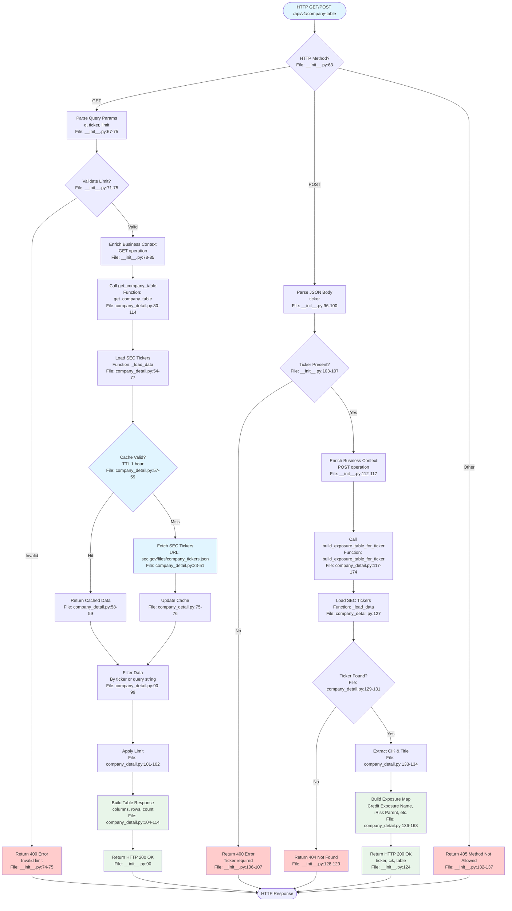

 

**Key Features**:

- Supports both GET (query) and POST (build) operations

- GET: Filters SEC company tickers by query string or ticker

- POST: Builds detailed exposure table for a specific ticker

- 1-hour in-memory cache for SEC data

- Returns company metadata including CIK, title, and exposure details

 

**File Location**: [Azure-Functions/CompanyTableFunction/\_\_init\_\_.py](Azure-Functions/CompanyTableFunction/__init__.py)

**Referenced Code**: [Azure-Functions/src/company_detail.py](Azure-Functions/src/company_detail.py)

 

---

 

#### CreditTableFunction

 

**Route**: `POST /api/v1/credit-table`

**Auth Level**: `function`

**Purpose**: Generates Key Credit Merits and Risks using LLM.

 

**Architecture**:

 

```mermaid

graph TD

    Start([HTTP POST /api/v1/credit-table]) --> ParseReq["Parse Request Body<br/>File: __init__.py:113"]

 

    ParseReq --> ValidateInput{"Validate Input<br/>ticker & period<br/>File: __init__.py:119-127"}

    ValidateInput -->|Invalid| Return400["Return 400 Error<br/>File: __init__.py:123-127"]

    ValidateInput -->|Valid| ParseOptionalParams["Parse Optional Params<br/>max_completion_tokens<br/>File: __init__.py:130"]

 

    ParseOptionalParams --> GetAzureConfig["Get Azure OpenAI Config<br/>api_key, endpoint, deployment<br/>File: __init__.py:133-138"]

 

    GetAzureConfig --> ValidateConfig{"Config Valid?<br/>File: __init__.py:140-145"}

    ValidateConfig -->|Invalid| Return500Config["Return 500 Config Error<br/>File: __init__.py:141-145"]

    ValidateConfig -->|Valid| NormalizePeriod["Normalize Period Format<br/>Function: normalize_period_arg<br/>File: __init__.py:148-154"]

 

    NormalizePeriod --> LoadPrompt["Load System Prompt<br/>Function: load_prompt<br/>File: __init__.py:159-164"]

 

    LoadPrompt --> BuildClient["Build Azure OpenAI Client<br/>Function: build_azure_client<br/>File: __init__.py:167-172"]

 

    BuildClient --> EnrichContext["Enrich Business Context<br/>Function: enrich_with_business_context<br/>File: __init__.py:183-189"]

 

    EnrichContext --> CallProcessTicker["Call process_ticker<br/>Function: process_ticker<br/>File: run_credit_risk_merits.py:534-695"]

 

    CallProcessTicker --> ListPDFs["List PDFs for Ticker<br/>Function: list_pdfs_for_ticker<br/>File: run_credit_risk_merits.py:256-264"]

 

    ListPDFs --> PDFsFound{"PDFs Found?<br/>File: run_credit_risk_merits.py:557-559"}

    PDFsFound -->|No| ReturnNoPDFs["Return Error<br/>No PDFs found<br/>File: run_credit_risk_merits.py:558"]

 

    PDFsFound -->|Yes| OrganizeFilings["Organize Filings<br/>Function: organize_filings<br/>File: run_credit_risk_merits.py:489-505"]

 

    OrganizeFilings --> FilterPeriod{"Period Filter?<br/>File: run_credit_risk_merits.py:568-569"}

 

    FilterPeriod --> BuildOutputPaths["Build Output Paths<br/>JSON & CSV blob paths<br/>File: run_credit_risk_merits.py:571-573"]

 

    BuildOutputPaths --> CheckCache{"Check Blob Cache?<br/>Function: blob_exists<br/>File: run_credit_risk_merits.py:576"}

 

    CheckCache -->|Cache Hit| DownloadCached["Download Cached JSON<br/>Function: download_blob_json<br/>File: run_credit_risk_merits.py:577"]

    DownloadCached --> ReturnCached["Return Cached Result<br/>cached: true<br/>File: run_credit_risk_merits.py:578-590"]

 

    CheckCache -->|Cache Miss| ExtractPDFText["Extract PDF Text<br/>Function: extract_text_from_pdf<br/>File: run_credit_risk_merits.py:267-279"]

 

    ExtractPDFText --> ChunkText["Chunk Text<br/>Function: chunk_text<br/>max_chars: 12000, overlap: 400<br/>File: run_credit_risk_merits.py:316-332"]

 

    ChunkText --> BuildMessages["Build Multi-Turn Messages<br/>System + User chunks + [END]<br/>File: run_credit_risk_merits.py:351-375"]

 

    BuildMessages --> CallLLM["Call Azure OpenAI<br/>Function: client.chat.completions.create<br/>File: run_credit_risk_merits.py:376-392"]

 

    CallLLM --> EnrichLLMSpan["Enrich LLM Span<br/>Cost & content tracking<br/>File: run_credit_risk_merits.py:389-390"]

 

    EnrichLLMSpan --> ExtractJSON["Extract JSON from Response<br/>Function: extract_json_from_text<br/>File: run_credit_risk_merits.py:399-430"]

 

    ExtractJSON --> ValidateJSON{"JSON Valid?<br/>File: run_credit_risk_merits.py:629-631"}

    ValidateJSON -->|Invalid| ReturnJSONError["Return Error<br/>Invalid JSON<br/>File: run_credit_risk_merits.py:630-631"]

 

    ValidateJSON -->|Valid| SaveJSON["Save JSON to Blob<br/>Function: upload_json_to_blob<br/>File: run_credit_risk_merits.py:632"]

 

    SaveJSON --> SaveCSV["Save CSV to Blob<br/>Function: save_csv_from_json<br/>File: run_credit_risk_merits.py:633"]

 

    SaveCSV --> BuildResultRecord["Build Result Record<br/>period, ok, json_path, csv_path<br/>File: run_credit_risk_merits.py:634-641"]

 

    BuildResultRecord --> ReturnNew["Return New Result<br/>cached: false"]

 

    ReturnCached --> FindPeriodRecord["Find Period Record<br/>File: __init__.py:220-224"]

    ReturnNew --> FindPeriodRecord

    ReturnNoPDFs --> FindPeriodRecord

    ReturnJSONError --> FindPeriodRecord

 

    FindPeriodRecord --> CheckOutput{"Output Valid?<br/>File: __init__.py:226-234"}

    CheckOutput -->|No| Return500Error["Return 500 Error<br/>No output produced<br/>File: __init__.py:233-234"]

 

    CheckOutput -->|Yes| BuildResponsePayload["Build Response Payload<br/>status, ticker, period, cached, blob_paths, json_data<br/>File: __init__.py:236-251"]

 

    BuildResponsePayload --> Return200["Return HTTP 200 OK<br/>Function: _ok<br/>File: __init__.py:254"]

 

    Return400 --> End([HTTP Response])

    Return500Config --> End

    Return500Error --> End

    Return200 --> End

 

    style Start fill:#e1f5ff

    style CheckCache fill:#e1f5ff

    style ListPDFs fill:#e1f5ff

    style CallLLM fill:#fff4e1

    style EnrichLLMSpan fill:#fff4e1

    style SaveJSON fill:#e8f5e9

    style SaveCSV fill:#e8f5e9

    style Return200 fill:#e8f5e9

    style Return400 fill:#ffcccc

    style Return500Config fill:#ffcccc

    style Return500Error fill:#ffcccc

```

 

**Key Features**:

- Cache-first strategy: checks blob storage before LLM processing

- Multi-turn LLM conversation with text chunking (12K chars, 400 overlap)

- Processes 10-K and 10-Q SEC filings

- Extracts key credit risks and merits using structured prompts

- JSON and CSV output formats

- Cost and content tracking with Application Insights telemetry

 

**File Location**: [Azure-Functions/CreditTableFunction/\_\_init\_\_.py](Azure-Functions/CreditTableFunction/__init__.py)

**Referenced Code**: [Azure-Functions/src/run_credit_risk_merits.py](Azure-Functions/src/run_credit_risk_merits.py)

 

---

 

### News & Credit Risk Components

 

#### NewsFunction

 

**Route**: `POST /api/v1/news/analyze`

**Auth Level**: `function`

**Purpose**: Credit risk news analysis - fetches news from multiple sources and analyzes for risk signals.

 

**Architecture**:

 

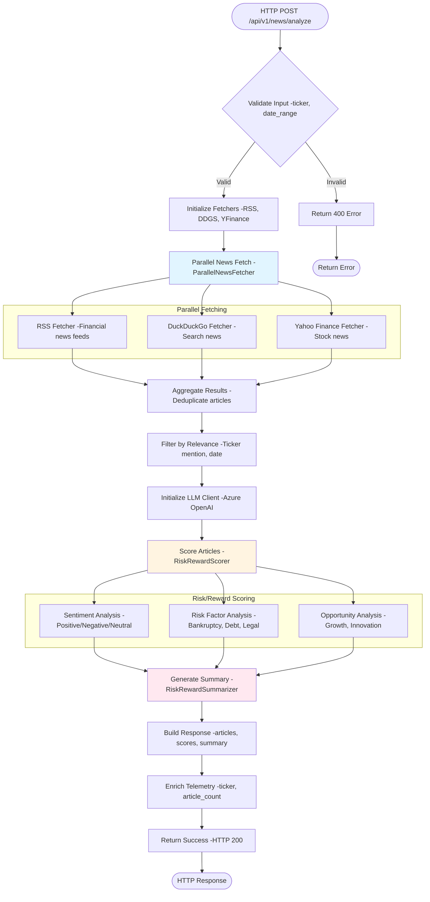

 

**Key Features**:

- Multi-source news fetching (yfinance, DuckDuckGo, Google RSS)

- Weighted risk keyword taxonomy (7 categories)

- Risk level classification (CRITICAL to NEUTRAL)

- Optional LLM summarization

 

**File Location**: [Azure-Functions/NewsFunction/\_\_init\_\_.py](Azure-Functions/NewsFunction/__init__.py)

**Component Directory**: [Azure-Functions/news_component/](Azure-Functions/news_component/)

**Detailed Documentation**: [Azure-Functions/news_component/README.md](Azure-Functions/news_component/README.md)

 

---

 

### Interactive Chat Components

 

#### LineageStartFunction

 

**Route**: `POST /api/v1/lineage/chat/start`

**Auth Level**: `function`

**Purpose**: Initiates a conversational session for exploring cap table source lineage.

 

**Architecture**:

 

```mermaid

graph TD

    Start([HTTP POST /api/v1/lineage/chat/start]) --> ParseReq["Parse Request Body<br/>File: __init__.py:49"]

 

    ParseReq --> ValidateTicker{"Validate Ticker?<br/>File: __init__.py:58-65"}

    ValidateTicker -->|Missing| Return400["Return 400 Error<br/>ticker required<br/>File: __init__.py:60-65"]

 

    ValidateTicker -->|Valid| EnrichContext["Enrich Business Context<br/>Function: enrich_with_business_context<br/>File: __init__.py:70-74"]

 

    EnrichContext --> FetchLineageData["Fetch Lineage Data<br/>Function: get_combined_json_data_from_blob<br/>File: data_lineage_agent.py:141-199"]

 

    FetchLineageData --> ListCapBlobs["List Cap Output Blobs<br/>Function: list_blobs<br/>Prefix: TICKER/cap_outputs/<br/>File: data_lineage_agent.py:155-158"]

 

    ListCapBlobs --> FindLatestCap["Find Latest Cap JSON<br/>Function: _latest_cap_blob_for_ticker<br/>File: data_lineage_agent.py:93-138"]

 

    FindLatestCap --> BlobFound{"Blob Found?<br/>File: data_lineage_agent.py:159-162"}

    BlobFound -->|No| Return404["Return 404 Not Found<br/>No logs in blob storage<br/>File: __init__.py:79-84"]

 

    BlobFound -->|Yes| DownloadCapJSON["Download Cap JSON<br/>Function: get_blob_content<br/>File: data_lineage_agent.py:164"]

 

    DownloadCapJSON --> ExtractSourceLineage["Extract SOURCE_LINEAGE<br/>Section from cap JSON<br/>File: data_lineage_agent.py:166-178"]

 

    ExtractSourceLineage --> FormatLineageString["Format Lineage String<br/>Delimiter: SOURCE_LINEAGE START/END<br/>File: data_lineage_agent.py:180-184"]

 

    FormatLineageString --> LoadSystemPrompt["Load System Prompt<br/>Function: _load_system_prompt<br/>File: data_lineage_agent.py:222-241"]

 

    LoadSystemPrompt --> GenerateSessionID["Generate Session ID<br/>uuid.uuid4().hex<br/>File: __init__.py:89"]

 

    GenerateSessionID --> BuildBaseMessages["Build Base Messages<br/>System + User context<br/>File: __init__.py:91-100"]

 

    BuildBaseMessages --> CreateSessionData["Create Session Data<br/>ticker, messages, created_at<br/>File: __init__.py:102-106"]

 

    CreateSessionData --> SaveSession["Save Session to Blob<br/>Function: session_manager.save_session<br/>File: session_manager.py:28-45"]

 

    SaveSession --> UploadSessionBlob["Upload Session Blob<br/>Path: lineage-sessions/session_{id}.json<br/>File: session_manager.py:36-41"]

 

    UploadSessionBlob --> CheckSaveSuccess{"Save Success?<br/>File: __init__.py:109-116"}

    CheckSaveSuccess -->|No| Return500["Return 500 Error<br/>Failed to create session<br/>File: __init__.py:111-116"]

 

    CheckSaveSuccess -->|Yes| Return200["Return HTTP 200 OK<br/>session_id<br/>File: __init__.py:121-127"]

 

    Return400 --> End([HTTP Response])

    Return404 --> End

    Return500 --> End

    Return200 --> End

 

    style Start fill:#e1f5ff

    style ListCapBlobs fill:#e1f5ff

    style DownloadCapJSON fill:#e1f5ff

    style UploadSessionBlob fill:#e8f5e9

    style Return200 fill:#e8f5e9

    style Return400 fill:#ffcccc

    style Return404 fill:#ffcccc

    style Return500 fill:#ffcccc

```

 

**Key Features**:

- Fetches latest cap table JSON from blob storage

- Extracts SOURCE_LINEAGE section for lineage exploration

- Creates session with UUID and stores in blob storage

- Session expires after 24 hours

- System prompt loaded from YAML file

 

**File Location**: [Azure-Functions/LineageStartFunction/\_\_init\_\_.py](Azure-Functions/LineageStartFunction/__init__.py)

**Referenced Code**:

- [Azure-Functions/src/agents/data_lineage_agent.py](Azure-Functions/src/agents/data_lineage_agent.py)

- [Azure-Functions/src/session_manager.py](Azure-Functions/src/session_manager.py)

 

---

 

#### LineageMessageFunction

 

**Route**: `POST /api/v1/lineage/chat/message`

**Auth Level**: `function`

**Purpose**: Processes chat messages within an existing lineage exploration session.

 

**Architecture**:

 

```mermaid

graph TD

    Start([HTTP POST /api/v1/lineage/chat/message]) --> ParseReq["Parse Request Body<br/>File: __init__.py:64"]

 

    ParseReq --> ValidateInput{"Validate Input?<br/>session_id & message<br/>File: __init__.py:73-90"}

    ValidateInput -->|Missing session_id| Return400Session["Return 400 Error<br/>session_id required<br/>File: __init__.py:77-82"]

    ValidateInput -->|Missing message| Return400Message["Return 400 Error<br/>message required<br/>File: __init__.py:85-90"]

 

    ValidateInput -->|Valid| EnrichContext["Enrich Business Context<br/>Function: enrich_with_business_context<br/>File: __init__.py:95-99"]

 

    EnrichContext --> LoadSession["Load Session from Blob<br/>Function: session_manager.get_session<br/>File: session_manager.py:47-67"]

 

    LoadSession --> DownloadSessionBlob["Download Session Blob<br/>Path: lineage-sessions/session_{id}.json<br/>File: session_manager.py:50-52"]

 

    DownloadSessionBlob --> CheckExpired{"Session Expired?<br/>24 hour TTL check<br/>File: session_manager.py:59-62"}

    CheckExpired -->|Yes| DeleteSession["Delete Expired Session<br/>Function: delete_session<br/>File: session_manager.py:61"]

    DeleteSession --> Return404["Return 404 Not Found<br/>Invalid session_id<br/>File: __init__.py:104-109"]

 

    CheckExpired -->|No| SessionFound{"Session Exists?<br/>File: __init__.py:102-109"}

    SessionFound -->|No| Return404

 

    SessionFound -->|Yes| GetAzureConfig["Get Azure OpenAI Config<br/>Function: _azure_openai_config<br/>File: __init__.py:43-55"]

 

    GetAzureConfig --> ValidateConfig{"Config Valid?<br/>File: __init__.py:113-119"}

    ValidateConfig -->|Invalid| Return503["Return 503 Service Unavailable<br/>Azure OpenAI not configured<br/>File: __init__.py:114-119"]

 

    ValidateConfig -->|Valid| BuildClient["Build Azure OpenAI Client<br/>AzureOpenAI instance<br/>File: __init__.py:121-125"]

 

    BuildClient --> ComposeMessages["Compose Messages<br/>session messages + new user message<br/>File: __init__.py:129-131"]

 

    ComposeMessages --> CallLLM["Call Azure OpenAI<br/>Function: client.chat.completions.create<br/>File: __init__.py:132-141"]

 

    CallLLM --> EnrichLLMSpan["Enrich LLM Span<br/>Cost & content tracking<br/>File: __init__.py:144-145"]

 

    EnrichLLMSpan --> ExtractReply["Extract Reply<br/>From response.choices[0].message.content<br/>File: __init__.py:147-153"]

 

    ExtractReply --> UpdateMessages["Update Session Messages<br/>Append user + assistant messages<br/>File: __init__.py:156"]

 

    UpdateMessages --> SaveUpdatedSession["Save Updated Session<br/>Function: session_manager.save_session<br/>File: __init__.py:159"]

 

    SaveUpdatedSession --> UploadUpdatedBlob["Upload Updated Session Blob<br/>Path: lineage-sessions/session_{id}.json<br/>File: session_manager.py:33-42"]

 

    UploadUpdatedBlob --> Return200["Return HTTP 200 OK<br/>session_id, reply<br/>File: __init__.py:164-171"]

 

    Return400Session --> End([HTTP Response])

    Return400Message --> End

    Return404 --> End

    Return503 --> End

    Return200 --> End

 

    style Start fill:#e1f5ff

    style LoadSession fill:#e1f5ff

    style DownloadSessionBlob fill:#e1f5ff

    style CallLLM fill:#fff4e1

    style EnrichLLMSpan fill:#fff4e1

    style SaveUpdatedSession fill:#e8f5e9

    style UploadUpdatedBlob fill:#e8f5e9

    style Return200 fill:#e8f5e9

    style Return400Session fill:#ffcccc

    style Return400Message fill:#ffcccc

    style Return404 fill:#ffcccc

    style Return503 fill:#ffcccc

```

 

**Key Features**:

- Session-based multi-turn conversation

- Loads session from blob storage with expiration check

- Integrates with Azure OpenAI for natural language responses

- Updates session history after each interaction

- Cost and content tracking with Application Insights telemetry

 

**File Location**: [Azure-Functions/LineageMessageFunction/\_\_init\_\_.py](Azure-Functions/LineageMessageFunction/__init__.py)

**Referenced Code**: [Azure-Functions/src/session_manager.py](Azure-Functions/src/session_manager.py)

 

---

 

#### OnDemandInsightsFunction

 

**Route**: `POST /api/v1/query`

**Auth Level**: `function`

**Purpose**: Ad-hoc financial insights query endpoint with RAG (Retrieval-Augmented Generation).

 

**Architecture**:

 

```mermaid

graph TD

    Start([HTTP POST /api/v1/query]) --> ParseReq["Parse Request Body<br/>File: __init__.py:100"]

 

    ParseReq --> ValidateInput{"Validate Input?<br/>company_id & question<br/>File: __init__.py:107-116"}

    ValidateInput -->|Missing company_id| Return400CompanyID["Return 400 Error<br/>company_id required<br/>File: __init__.py:110-112"]

    ValidateInput -->|Missing question| Return400Question["Return 400 Error<br/>question required<br/>File: __init__.py:114-116"]

 

    ValidateInput -->|Valid| EnrichContext["Enrich Business Context<br/>Function: enrich_with_business_context<br/>File: __init__.py:119-124"]

 

    EnrichContext --> ChatStart["Initialize Chat Session<br/>Function: _odi_chat_start_logic<br/>File: __init__.py:57-75"]

 

    ChatStart --> LoadChatHistory["Load Chat History<br/>Function: load_chat_history<br/>File: chat_engine.py:156-178"]

 

    LoadChatHistory --> CheckHistory{"History Exists?<br/>File: __init__.py:62"}

    CheckHistory -->|No| CreateGreeting["Create Initial Greeting<br/>Assistant message<br/>File: __init__.py:64-68"]

    CreateGreeting --> SaveInitialHistory["Save Initial History<br/>Function: save_chat_history<br/>File: chat_engine.py:180-186"]

 

    CheckHistory -->|Yes| ChatMessage["Process Chat Message<br/>Function: _odi_chat_message_logic<br/>File: __init__.py:77-90"]

    SaveInitialHistory --> ChatMessage

 

    ChatMessage --> CallChatEngine["Call Chat Engine<br/>Function: chat<br/>File: chat_engine.py:300-400"]

 

    CallChatEngine --> CheckEmbeddings{"Embeddings Exist?<br/>Function: embeddings_exist_for_ticker<br/>File: chat_engine.py:144-151"}

 

    CheckEmbeddings -->|No| ListPDFs["List PDFs for Ticker<br/>Function: list_pdfs_for_ticker<br/>Prefix: TICKER/pdfs/<br/>File: chat_engine.py:122-142"]

    ListPDFs --> DownloadPDFs["Download PDFs from Blob<br/>Function: get_blob_content<br/>File: chat_engine.py:240-270"]

    DownloadPDFs --> ChunkDocuments["Chunk Documents<br/>RecursiveCharacterTextSplitter<br/>chunk_size: 1000, overlap: 200<br/>File: chat_engine.py:274-280"]

    ChunkDocuments --> CreateEmbeddings["Create Embeddings<br/>AzureOpenAIEmbeddings<br/>File: chat_engine.py:198-210"]

    CreateEmbeddings --> BuildVectorDB["Build Vector DB<br/>FAISS.from_documents<br/>File: chat_engine.py:290-295"]

    BuildVectorDB --> SaveEmbeddings["Save Embeddings to Blob<br/>index.faiss + index.pkl<br/>File: chat_engine.py:310-330"]

 

    CheckEmbeddings -->|Yes| LoadEmbeddings["Load Embeddings from Cache<br/>In-memory EMBEDDING_CACHE<br/>File: chat_engine.py:340-360"]

    SaveEmbeddings --> LoadEmbeddings

 

    LoadEmbeddings --> RetrieveContext["Retrieve Relevant Context<br/>similarity_search(query, k=5)<br/>File: chat_engine.py:370-385"]

 

    RetrieveContext --> LoadODIPrompt["Load ODI System Prompt<br/>From odi_prompt.yaml<br/>File: chat_engine.py:390-410"]

 

    LoadODIPrompt --> BuildRAGMessages["Build RAG Messages<br/>System + Retrieved context + History + User query<br/>File: chat_engine.py:420-450"]

 

    BuildRAGMessages --> CallLLM["Call Azure OpenAI<br/>Function: client.chat.completions.create<br/>File: chat_engine.py:460-480"]

 

    CallLLM --> EnrichLLMSpan["Enrich LLM Span<br/>Cost & content tracking<br/>File: chat_engine.py:482-483"]

 

    EnrichLLMSpan --> ExtractReply["Extract Reply<br/>From response.choices[0].message.content<br/>File: chat_engine.py:490-495"]

 

    ExtractReply --> UpdateChatHistory["Update Chat History<br/>Append user + assistant<br/>File: chat_engine.py:500-505"]

 

    UpdateChatHistory --> SaveUpdatedHistory["Save Updated History<br/>Function: save_chat_history<br/>File: chat_engine.py:510-515"]

 

    SaveUpdatedHistory --> CheckError{"Chat Error?<br/>File: __init__.py:84-87"}

    CheckError -->|Yes| Return500["Return 500 Error<br/>Chat execution failed<br/>File: __init__.py:154-155"]

 

    CheckError -->|No| Return200["Return HTTP 200 OK<br/>status, company_id, question, response<br/>File: __init__.py:144-149"]

 

    Return400CompanyID --> End([HTTP Response])

    Return400Question --> End

    Return500 --> End

    Return200 --> End

 

    style Start fill:#e1f5ff

    style ListPDFs fill:#e1f5ff

    style DownloadPDFs fill:#e1f5ff

    style LoadEmbeddings fill:#e1f5ff

    style CheckEmbeddings fill:#e1f5ff

    style CreateEmbeddings fill:#fff4e1

    style CallLLM fill:#fff4e1

    style EnrichLLMSpan fill:#fff4e1

    style SaveEmbeddings fill:#e8f5e9

    style SaveUpdatedHistory fill:#e8f5e9

    style Return200 fill:#e8f5e9

    style Return400CompanyID fill:#ffcccc

    style Return400Question fill:#ffcccc

    style Return500 fill:#ffcccc

```

 

**Key Features**:

- RAG (Retrieval-Augmented Generation) architecture

- FAISS vector database for semantic search

- AzureOpenAIEmbeddings for document embeddings

- Automatic PDF ingestion from blob storage

- In-memory embedding cache for performance

- Multi-turn chat history with context preservation

- Text chunking: 1000 chars with 200 overlap

- Top-5 similarity search for relevant context

- Cost and content tracking with Application Insights telemetry

 

**File Location**: [Azure-Functions/OnDemandInsightsFunction/\_\_init\_\_.py](Azure-Functions/OnDemandInsightsFunction/__init__.py)

**Referenced Code**: [Azure-Functions/src/chat_engine.py](Azure-Functions/src/chat_engine.py)

 

---

 

### Supporting Components

 

#### CompFunction

 

**Route**: `POST /api/v1/comp`

**Auth Level**: `function`

**Purpose**: Comparable analysis - fetches peer company metrics from S&P Capital IQ API and generates comparison tables.

 

**Architecture**:

 

```mermaid

graph TD

    Start([HTTP POST /api/v1/comp]) --> ParseReq["Parse Request<br/>Query params or JSON body<br/>File: __init__.py:120"]

 

    ParseReq --> ValidateInput{"Validate Input?<br/>ticker & period required<br/>File: __init__.py:126-140"}

    ValidateInput -->|Missing| Return400["Return 400 Error<br/>ticker & period required<br/>File: __init__.py:127-140"]

 

    ValidateInput -->|Valid| NormalizePeriod["Normalize Period<br/>Function: _safe_period<br/>File: __init__.py:143"]

 

    NormalizePeriod --> EnrichContext["Enrich Business Context<br/>Function: enrich_with_business_context<br/>File: __init__.py:146-152"]

 

    EnrichContext --> CallRunWithPeers["Call run_with_peers<br/>Function: run_with_peers<br/>File: run_comp_table.py:900-1050"]

 

    CallRunWithPeers --> DetectPeriod["Detect Period Type<br/>ANNUAL (YYYY) or QUARTER (YYYY_Qn)<br/>Function: detect_period<br/>File: run_comp_table.py:164-190"]

 

    DetectPeriod --> GetSPToken["Get S&P Capital IQ Token<br/>Function: get_sp_token<br/>File: run_comp_table.py:250-280"]

 

    GetSPToken --> ResolveMainTicker["Resolve Main Ticker<br/>Function: resolve_exchange_and_identifier<br/>File: run_comp_table.py:300-350"]

 

    ResolveMainTicker --> FetchMainPeers["Fetch Main Company Peers<br/>API: IQ_QUICK_COMP mnemonic<br/>File: run_comp_table.py:400-450"]

 

    FetchMainPeers --> ResolvePeerIdentifiers["Resolve Peer Identifiers<br/>Normalize EXCH:TICKER to TICKER:EXCH<br/>Function: normalize_identifier_for_api<br/>File: run_comp_table.py:136-165"]

 

    ResolvePeerIdentifiers --> FetchPeerMetrics["Fetch Peer Metrics<br/>API: GDSHE function<br/>Mnemonics: REVENUE, EBITDA, DEBT, etc.<br/>File: run_comp_table.py:500-600"]

 

    FetchPeerMetrics --> CalculateLTM["Calculate LTM Metrics<br/>LTM = curr_ytd - prior_ytd + last_fy<br/>File: run_comp_table.py:726-760"]

 

    CalculateLTM --> Calculate3YAvg["Calculate 3-Year Average<br/>Average of prior 3 fiscal years<br/>File: run_comp_table.py:770-810"]

 

    Calculate3YAvg --> ApplyPensionRule["Apply Pension Rule<br/>Pension adjustment logic<br/>File: run_comp_table.py:430-450"]

 

    ApplyPensionRule --> CalculateRatios["Calculate Financial Ratios<br/>Leverage, Coverage, FCF, etc.<br/>File: run_comp_table.py:820-900"]

 

    CalculateRatios --> BuildLineage["Build Source Lineage<br/>Track API calls and calculations<br/>File: run_comp_table.py:600-640"]

 

    BuildLineage --> UploadPeerJSON["Upload Peer JSON to Blob<br/>Path: TICKER/comp_outputs/PEER/PEER_metrics_period.json<br/>File: run_comp_table.py:950-980"]

 

    UploadPeerJSON --> BuildCompTable["Build Comparison Table<br/>Aggregate all peer metrics<br/>File: run_comp_table.py:1000-1030"]

 

    BuildCompTable --> UploadCompTable["Upload Comp Table to Blob<br/>Path: TICKER/comp_outputs/comp-table.json<br/>File: run_comp_table.py:1035-1045"]

 

    UploadCompTable --> Return200["Return HTTP 200 OK<br/>Comp table JSON<br/>File: __init__.py:163-167"]

 

    Return400 --> End([HTTP Response])

    Return200 --> End

 

    style Start fill:#e1f5ff

    style GetSPToken fill:#e1f5ff

    style FetchMainPeers fill:#e1f5ff

    style FetchPeerMetrics fill:#e1f5ff

    style UploadPeerJSON fill:#e8f5e9

    style UploadCompTable fill:#e8f5e9

    style Return200 fill:#e8f5e9

    style Return400 fill:#ffcccc

```

 

**Key Features**:

- Integrates with S&P Capital IQ API for peer company data

- Supports annual (YYYY) and quarterly (YYYY_Qn) periods

- Calculates LTM (Last Twelve Months) metrics

- Calculates 3-year average metrics

- Computes financial ratios: leverage, coverage, FCF

- Source lineage tracking for all calculations

- Automatic peer discovery via IQ_QUICK_COMP mnemonic

- Uploads outputs to Azure Blob Storage

 

**File Location**: [Azure-Functions/CompFunction/\_\_init\_\_.py](Azure-Functions/CompFunction/__init__.py)

**Referenced Code**: [Azure-Functions/src/run_comp_table.py](Azure-Functions/src/run_comp_table.py)

 

---

 

#### RatingsRationaleFunction

 

**Route**: `POST /api/v1/ratings-rationale`

**Auth Level**: `function`

**Purpose**: Extracts S&P credit ratings rationale from XpressAPI articles using LLM.

 

**Architecture**:

 

```mermaid

graph TD

    Start([HTTP POST /api/v1/ratings-rationale]) --> ParseReq["Parse Request Body<br/>File: __init__.py:120"]

 

    ParseReq --> ValidateInput{"Validate Input?<br/>ticker & period<br/>File: __init__.py:126-134"}

    ValidateInput -->|Invalid| Return400["Return 400 Error<br/>ticker or period missing<br/>File: __init__.py:129-134"]

 

    ValidateInput -->|Valid| ParseOptionalParams["Parse Optional Params<br/>force_rebuild, api_key, endpoint, deployment<br/>File: __init__.py:137-145"]

 

    ParseOptionalParams --> ValidateConfig{"Azure OpenAI Config Valid?<br/>File: __init__.py:147-152"}

    ValidateConfig -->|Invalid| Return500Config["Return 500 Config Error<br/>Missing OpenAI credentials<br/>File: __init__.py:148-152"]

 

    ValidateConfig -->|Valid| EnrichContext["Enrich Business Context<br/>Function: enrich_with_business_context<br/>File: __init__.py:157-164"]

 

    EnrichContext --> BuildClient["Build Azure OpenAI Client<br/>Function: build_azure_client<br/>File: __init__.py:168"]

 

    BuildClient --> CallProcessRatings["Call process_ratings_rationale<br/>Function: process_ratings_rationale<br/>File: run_ratings_rationale.py:650-850"]

 

    CallProcessRatings --> CheckCache{"Check Blob Cache?<br/>force_rebuild=False<br/>File: run_ratings_rationale.py:680-690"}

    CheckCache -->|Cache Hit| DownloadCached["Download Cached JSON<br/>Path: TICKER/ratings_rationale/output/<br/>File: run_ratings_rationale.py:685-688"]

    DownloadCached --> ReturnCached["Return Cached Result"]

 

    CheckCache -->|Cache Miss| GetXpressToken["Get XpressAPI Token<br/>Function: get_xpress_token<br/>File: run_ratings_rationale.py:250-280"]

 

    GetXpressToken --> GetCapIQToken["Get Capital IQ Token<br/>Function: get_sp_token<br/>File: run_ratings_rationale.py:300-330"]

 

    GetCapIQToken --> ResolveIdentifier["Resolve Ticker Identifier<br/>Function: resolve_exchange_and_identifier<br/>File: run_ratings_rationale.py:168-230"]

 

    ResolveIdentifier --> FetchCiqCompanyID["Fetch CiqCompanyID<br/>API: IQ_COMPANY_ID mnemonic<br/>File: run_ratings_rationale.py:350-380"]

 

    FetchCiqCompanyID --> CalculateDateRange["Calculate Date Range<br/>Period to from_date/to_date<br/>File: run_ratings_rationale.py:700-730"]

 

    CalculateDateRange --> GetArticleList["Get Article List<br/>XpressAPI: ArticleList endpoint<br/>File: run_ratings_rationale.py:400-460"]

 

    GetArticleList --> FilterArticles["Filter Ratings Direct Articles<br/>Exclude industry outlooks<br/>Keywords: RatingsDirect, Research Update<br/>File: run_ratings_rationale.py:515-600"]

 

    FilterArticles --> ArticlesFound{"Articles Found?<br/>File: run_ratings_rationale.py:750"}

    ArticlesFound -->|No| ReturnNoArticles["Return Error<br/>No articles found<br/>File: run_ratings_rationale.py:752-755"]

 

    ArticlesFound -->|Yes| SelectArticle["Select Most Recent Article<br/>Sort by publication date<br/>File: run_ratings_rationale.py:760-770"]

 

    SelectArticle --> GetArticleContent["Get Article Content<br/>XpressAPI: ArticleContent endpoint<br/>Response type: XML<br/>File: run_ratings_rationale.py:466-512"]

 

    GetArticleContent --> DecodeXML["Decode Base64 XML<br/>base64.b64decode<br/>File: run_ratings_rationale.py:504-509"]

 

    DecodeXML --> UploadArticleXML["Upload Article XML to Blob<br/>Path: TICKER/ratings_rationale/articles/<br/>File: run_ratings_rationale.py:780-790"]

 

    UploadArticleXML --> BuildLLMPrompt["Build LLM Prompt<br/>Extract: company_name, s&p_rating, merits, risks, upgrade_if, downgrade_if<br/>File: run_ratings_rationale.py:800-820"]

 

    BuildLLMPrompt --> CallLLM["Call Azure OpenAI<br/>Function: client.chat.completions.create<br/>File: run_ratings_rationale.py:825-845"]

 

    CallLLM --> EnrichLLMSpan["Enrich LLM Span<br/>Cost & content tracking<br/>File: run_ratings_rationale.py:848-849"]

 

    EnrichLLMSpan --> ExtractJSON["Extract JSON from Response<br/>Parse structured rationale<br/>File: run_ratings_rationale.py:855-870"]

 

    ExtractJSON --> ValidateJSON{"JSON Valid?<br/>File: run_ratings_rationale.py:875"}

    ValidateJSON -->|Invalid| ReturnJSONError["Return Error<br/>Invalid JSON from LLM<br/>File: __init__.py:190-192"]

 

    ValidateJSON -->|Valid| BuildMetadata["Build Metadata<br/>article_id, blob_paths<br/>File: run_ratings_rationale.py:880-895"]

 

    BuildMetadata --> UploadOutputJSON["Upload Output JSON to Blob<br/>Path: TICKER/ratings_rationale/output/<br/>File: run_ratings_rationale.py:900-910"]

 

    UploadOutputJSON --> BuildResponse["Build Response Payload<br/>status, ticker, period, merits, risks, etc.<br/>File: __init__.py:195-206"]

 

    BuildResponse --> Return200["Return HTTP 200 OK<br/>Function: _ok<br/>File: __init__.py:208"]

 

    ReturnCached --> BuildResponse

    ReturnNoArticles --> End([HTTP Response])

    ReturnJSONError --> End

    Return400 --> End

    Return500Config --> End

    Return200 --> End

 

    style Start fill:#e1f5ff

    style CheckCache fill:#e1f5ff

    style GetXpressToken fill:#e1f5ff

    style GetCapIQToken fill:#e1f5ff

    style GetArticleList fill:#e1f5ff

    style CallLLM fill:#fff4e1

    style EnrichLLMSpan fill:#fff4e1

    style UploadArticleXML fill:#e8f5e9

    style UploadOutputJSON fill:#e8f5e9

    style Return200 fill:#e8f5e9

    style Return400 fill:#ffcccc

    style Return500Config fill:#ffcccc

    style ReturnJSONError fill:#ffcccc

```

 

**Key Features**:

- Integrates with S&P XpressAPI for credit ratings articles

- Fetches articles filtered by date range and company

- Filters for S&P Ratings Direct company-specific articles

- Excludes industry outlooks and sector reports

- Downloads article content in XML format (base64 encoded)

- LLM extraction of structured data: merits, risks, upgrade/downgrade conditions

- Cache-first strategy with force_rebuild option

- Uploads article XML and extracted JSON to blob storage

- Cost and content tracking with Application Insights telemetry

 

**File Location**: [Azure-Functions/RatingsRationaleFunction/\_\_init\_\_.py](Azure-Functions/RatingsRationaleFunction/__init__.py)

**Referenced Code**: [Azure-Functions/src/run_ratings_rationale.py](Azure-Functions/src/run_ratings_rationale.py)

 

---

 

## Data & Storage

 

### Azure Blob Storage Containers

 

| Container | Purpose | Contents | Used By |

|-----------|---------|----------|---------|

| `hfa-outputs` | Historical Financial Analysis | `HFA_{TICKER}_{YYYYMMDD_HHMMSS}.json`, `.csv` | HFAFunction |

| `fsa-outputs` | Financial Statement Analysis | `FSA_{TICKER}_{YYYYMMDD_HHMMSS}.json` | FSAFunction |

| `cap-outputs` | Capitalization Tables | `cap_tables/`, `structures/`, `logs/` | CapTableFunction |

| `comp-outputs` | Comparable Analysis | `COMP_{TICKER}_{YYYYMMDD_HHMMSS}.json`, `.csv` | CompFunction |

| `compliance-certificate-outputs` | Covenant Tables | `{TICKER}/json/`, `{TICKER}/structure/` | CovenantTableFunction |

| `aqrr-outputs` | AQRR Reports | PDF and DOCX files | AQRRPDFFunction, AQRRWordFunction |

| `logs` | Function execution logs | `logs/{function-name}/{YYYY-MM-DD}/{timestamp}.log` | All functions (optional) |

 

**Connection String**: `AZURE_STORAGE_CONNECTION_STRING` or `AZURE_BLOB_STORAGE_CONNECTION_STRING`

 

### File System Storage (Local Development)

 

| Directory | Purpose |

|-----------|---------|

| `data_files/{TICKER}/` | Input XLSM files (Allvue data) |

| `pdfs/{TICKER}/` | SEC PDF filings (10-K, 10-Q) |

| `extracted_tables_pageindex/{TICKER}/` | Extracted tables (JSON/CSV), clusters, page index |

| `mappings/{TICKER}/{PERIOD}/` | Per-period mapping JSON files |

| `calculation_results/{TICKER}/{Annual\|YTD}/` | Calculated metrics JSON |

| `validation_results/{TICKER}/{PERIOD}/` | Matched/unmatched validation results |

| `cap_outputs/{TICKER}/` | Cap tables, structures, logs |

| `aqrr_structure/{TICKER}/` | AQRR template structures |

| `logs/{TICKER}/{PERIOD}/` | Agentic pipeline logs |

 

---

 

## Telemetry & Logging

 

### OpenTelemetry + Application Insights Integration

 

**Configuration File**: [Azure-Functions/src/telemetry_config.py](Azure-Functions/src/telemetry_config.py)

 

**Key Features**:

- ✅ Automatic OpenAI SDK instrumentation (captures prompts, completions, token usage)

- ✅ Cost calculation per LLM call (using pricing table in [telemetry_config.py:78-90](Azure-Functions/src/telemetry_config.py#L78-L90))

- ✅ Business context enrichment (ticker, filing_type, period, operation)

- ✅ Agentic workflow metadata (agent_role, workflow_state, decision_metadata)

- ✅ Correlation IDs and distributed tracing

 

### Initialization

 

```python

from src.telemetry_config import configure_telemetry, root_span, span, enrich_with_business_context

 

# Initialize once at app startup

configure_telemetry()

 

# Use in your code

with root_span("fsa-pipeline", seed=f"fsa:{ticker}:{timestamp}"):

    enrich_with_business_context(ticker="AAPL", filing_type="10-K", period="2024", operation="fsa_analysis")

 

    with span("extract-pdf", ticker="AAPL"):

        text = extract_text_from_pdf(...)

 

    with span("llm-call"):

        response = client.chat.completions.create(...)  # Auto-instrumented

```

 

**Reference**: [telemetry_config.py:125-262](Azure-Functions/src/telemetry_config.py#L125-L262)

 

### Cost Tracking

 

Each LLM call is enriched with cost data:

 

```python

from src.telemetry_config import enrich_llm_span_with_cost

 

response = client.chat.completions.create(...)

enrich_llm_span_with_cost(response)  # Adds gen_ai.usage.cost_usd to span

```

 

**Pricing Table** (USD per 1K tokens) - [telemetry_config.py:78-90](Azure-Functions/src/telemetry_config.py#L78-L90):

 

| Model | Input | Output |

|-------|--------|--------|

| `gpt-4.1` / `gpt-4-turbo` | $0.010 | $0.030 |

| `gpt-4o` | $0.005 | $0.015 |

| `gpt-4o-mini` / `gpt-4.1-mini` | $0.00015 | $0.0006 |

| `gpt-35-turbo` | $0.0015 | $0.002 |

 

### Viewing Telemetry

 

**Azure Portal**:

1. Navigate to Application Insights resource

2. Go to **Transaction search** or **Application map**

3. Filter by `cloud_RoleName` = `pgim-dealio-functions`

4. View traces with custom attributes:

   - `business.ticker`, `business.filing_type`, `business.period`

   - `gen_ai.usage.cost_usd`, `gen_ai.usage.prompt_tokens`, `gen_ai.usage.completion_tokens`

   - `agentic.agent_role`, `agentic.anchor_key`, `agentic.attempt`

 

**Kusto Query Example**:

```kusto

traces

| where timestamp > ago(1h)

| where cloud_RoleName == "pgim-dealio-functions"

| extend ticker = tostring(customDimensions["business.ticker"])

| extend cost = todouble(customDimensions["gen_ai.usage.cost_usd"])

| summarize TotalCost = sum(cost), CallCount = count() by ticker

| order by TotalCost desc

```

 

### Sampling

 

**Sampling is disabled** in `host.json` to capture 100% of telemetry:

 

```json

{

  "logging": {

    "applicationInsights": {

      "samplingSettings": {

        "isEnabled": false

      }

    }

  }

}

```

 

**Reference**: [host.json:4-9](Azure-Functions/host.json#L4-L9)

 

---

 

## Deployment

 

### Prerequisites

 

1. **Azure subscription** with:

   - Function App (Python 3.10+ on Linux recommended)

   - Storage Account

   - Azure OpenAI resource

   - Application Insights instance

 

2. **Azure CLI authenticated**:

```bash

az login

az account set --subscription <subscription-id>

```

 

### Deploy Using PowerShell Helper

 

```powershell

cd Azure-Functions

 

# Deploy to existing Function App

.\manage.ps1 -Action deployExisting `

  -ResourceGroup PGIM-Dealio `

  -FunctionAppName pgim-dealio `

  -StorageAccountName pgimdealio

 

# Test deployment

.\manage.ps1 -Action testDeployment `

  -ResourceGroup PGIM-Dealio `

  -FunctionAppName pgim-dealio

```

 

**Helper Script**: [Azure-Functions/manage.ps1](Azure-Functions/manage.ps1)

 

### Manual Deployment

 

```bash

cd Azure-Functions

 

# Deploy using Functions Core Tools

func azure functionapp publish <your-function-app-name>

```

 

### Configure Application Settings

 

After deployment, set environment variables in **Azure Portal → Function App → Configuration → Application settings**.

 

Add all variables from `local.settings.json` **except**:

- `FUNCTIONS_WORKER_RUNTIME` (auto-configured)

- `AzureWebJobsStorage` (auto-configured)

 

**Critical Settings**:

- `AZURE_OPENAI_ENDPOINT`

- `AZURE_OPENAI_DEPLOYMENT`

- `AZURE_OPENAI_API_KEY`

- `AZURE_OPENAI_API_VERSION`

- `AZURE_STORAGE_CONNECTION_STRING`

- `OTEL_APPLICATIONINSIGHTS_CONNECTION_STRING`

 

### Authentication

 

Functions use **Function-level authentication** (`authLevel: function`). When deployed:

 

1. **Get function key** from Azure Portal → Function App → Functions → `<FunctionName>` → Function Keys

2. **Include key in request**:

   - Header: `x-functions-key: <key>`

   - Or query param: `?code=<key>`

 

**Local development**: No authentication required (`func start` bypasses auth).

 

---

 

**Generated**: 2026-03-23 | **Author**: PGIM Dealio Team | **Version**: 1.0
